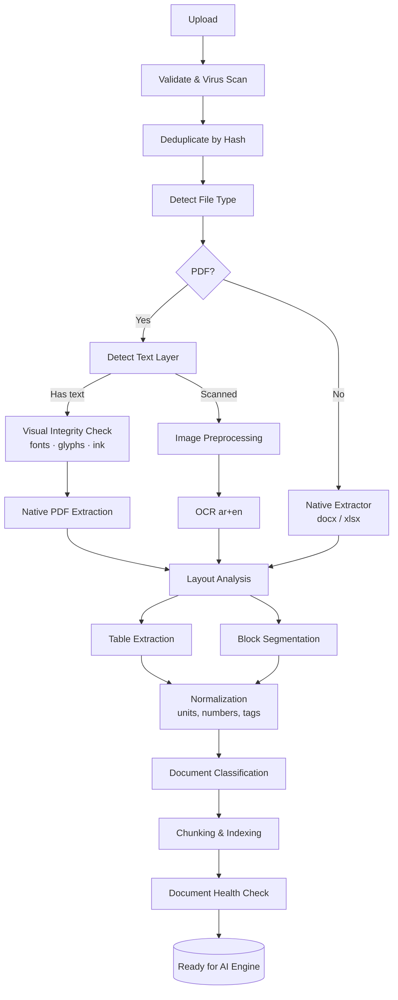

# 01 — Document Processing

| Field | Value |
|-------|-------|
| Version | 0.1 (Draft) |
| Owner | Backend / ML Engineering |
| Depends on | [Master PRD](./00-MASTER-PRD.md) |
| Consumed by | [AI Engine](./02-AI-ENGINE.md) |

> **مسؤولية هذه الطبقة:** تحويل ملف خام إلى **محتوى منظم مع Provenance كامل**.
> لا تفهم، لا تستنتج، لا تحكم. فقط تقرأ بدقة وتقول بصدق ما لم تستطع قراءته.

---

## 1. Pipeline Overview



كل مرحلة تُنفَّذ كـ **job مستقل** قابل لإعادة التشغيل بمفرده، وتكتب مخرجاتها إلى قاعدة البيانات قبل تسليم المرحلة التالية. فشل مرحلة على ملف واحد لا يُسقط المشروع كله.

---

## 2. Ingestion & Validation

### 2.1 قيود الرفع

| Constraint | V1 Value | ملاحظة |
|------------|----------|--------|
| Max file size | 500 MB | رسومات معمارية كبيرة |
| Max files per upload | 200 | رفع مجلد كامل |
| Max pages per project | 20,000 | حد ناعم مع تنبيه |
| Allowed extensions | `.pdf .docx .doc .xlsx .xls .csv` | ما عداها يُرفض بوضوح |

### 2.2 خطوات التحقق

1. **Extension + MIME sniffing** — لا يُوثَق بالامتداد وحده.
2. **Virus scan** (ClamAV أو ما يعادله) — قبل أي فتح للملف.
3. **PDF sanity** — عدد الصفحات، هل الملف مشفّر/محمي بكلمة مرور؟ (إن كان محميًا: طلب صريح من المستخدم، لا محاولة كسر).
4. **SHA-256 hash** — منع تكرار نفس الملف داخل المشروع، وربط الملف المكرر بالنسخة المعالَجة بدلًا من إعادة المعالجة.

### 2.3 Revision Handling

المستندات تصدر بإصدارات (Rev A, Rev B, IFC Rev 2…). النظام:

- يستخرج **Document Number** و **Revision** من Title Block أو اسم الملف أو الترويسة.
- يجمع الإصدارات تحت `document_family`.
- يُعلّم الإصدار الأحدث بـ `is_current = true` والباقي `superseded`.
- **المراجعة تعمل على الإصدار الحالي فقط**، لكن التقارير تُظهر متى تغيّر البند بين إصدارين (Change Awareness).

> **قاعدة:** إذا تعذّر تحديد الإصدار الأحدث بثقة، يسأل النظام المستخدم صراحةً بدل أن يخمّن. مراجعة مبنية على رسمة ملغاة أسوأ من عدم المراجعة.

---

## 3. Text Layer Detection

قرار جوهري يحدد مسار الملف كله:

```python
def classify_pdf_page(page) -> Literal["digital", "scanned", "hybrid"]:
    chars = len(page.extract_text() or "")
    images = page.image_area_ratio()          # نسبة مساحة الصور من الصفحة

    if chars > 200 and images < 0.5:
        return "digital"
    if chars < 50 and images > 0.5:
        return "scanned"
    return "hybrid"       # نص + صور ممسوحة → مسار مزدوج
```

- **digital** → استخراج مباشر (أدق وأسرع وأرخص).
- **scanned** → preprocessing ثم OCR.
- **hybrid** → استخراج النص الرقمي **و** OCR للمناطق الصورية، ثم دمج مع إزالة التكرار.

القرار يُتخذ **لكل صفحة** لا لكل ملف — كثير من المستندات تخلط صفحات رقمية مع مرفقات ممسوحة.

---

## 3.1 Visual Integrity Check

> **نجاح استخراج النص ليس دليلًا على أن المستند مقروء.**

الفرضية الضمنية في كل ما سبق أن الفشل يعني **غياب النص**. لكن توجد فئة أعطال معاكسة وأخطر:
صفحة تُخرج نصًا **سليمًا تمامًا** بينما هي بصريًا غير مقروءة للبشر — خط مضمّن تالف، أو خط مفقود
استبدله العارض، أو ملف عربي عولج بأداة لا تعرف RTL.

```
ما يستخرجه النظام:  محضر اجتماع رقم ١٤ — اجتماع التنسيق الفني   ✔ سليم
ما يراه المهندس:     بقع سوداء متناثرة                          ✖ غير مقروء
```

هذا يحدث فعلًا: PDF مولّد من CAD بخط غير مضمّن، ملف ضُغط بأداة أفسدت تفريع الخطوط
(font subsetting)، أو مستند مرّ على محوّل صيغ رديء. والنظام سيقول **«٥٢٠ صفحة قُرئت بنجاح»**
وهو صادق تقنيًا — وهذا أسوأ أنواع الصدق.

### الفحوصات — بترتيب التكلفة

تُطبَّق على الصفحات `digital` و `hybrid` فقط. الصفحات `scanned` صور أصلًا، فما يراه المستخدم
هو نفسه ما رآه الـ OCR.

| # | الفحص | التكلفة | ما يكشفه |
|---|-------|---------|----------|
| 1 | **Font embedding** — كل خط يستخدمه نص الصفحة مضمَّن، أو من الـ base-14 القياسية | مجانية (بنية PDF) | خط مفقود سيستبدله العارض بخط آخر |
| 2 | **Glyph presence** — معرّفات الرموز المُشار إليها موجودة فعلًا داخل برنامج الخط المضمَّن | مجانية (بنية PDF) | تفريع خط تالف — السبب الدقيق للعطب أعلاه |
| 3 | **Ink per character** — نسبة الحبر إلى عدد المحارف المستخرجة ضمن النطاق المتوقع لحجم الخط السائد | تصيير 72 dpi رمادي | كل ما فات الفحصين، بما فيه انهيار التخطيط |

```python
def visual_integrity(page) -> IntegrityResult:
    if page.kind == "scanned":
        return IntegrityResult(ok=True, reason="image page")

    for font in page.fonts_used_by_text():
        if not font.embedded and not font.is_base14:
            return IntegrityResult(False, "FONT_NOT_EMBEDDED", font.name)
        if font.embedded and font.missing_glyphs(page.referenced_gids()):
            return IntegrityResult(False, "GLYPHS_MISSING", font.name)

    chars = len(page.extract_text())
    if chars > 100:
        ink = render_ink_ratio(page, dpi=72)          # نسبة البكسل غير الأبيض
        if ink / chars < INK_PER_CHAR_FLOOR:          # مُعايَر حسب حجم الخط السائد
            return IntegrityResult(False, "RENDER_SUSPECT",
                                   f"ink/char={ink/chars:.2e}")
    return IntegrityResult(ok=True)
```

> **لماذا «حبر لكل محرف» ولا خط أساس ثابت:** لا يوجد baseline لمستند عميل لم نره من قبل.
> النسبة بين الحبر وعدد المحارف **ذاتية المرجع** — الصفحة تُقاس بنفسها. أما خطوط الأساس المسجّلة
> فتصلح فقط لملفات الاختبار الثابتة (انظر `tests/fixtures/`)، حيث الملف معروف ولا يتغير.

### السلوك عند الفشل

- الصفحة تُعلَّم `render_suspect = true`، وتُخزَّن صورتها المصيَّرة.
- تظهر في **Document Health Check** بتصنيف منفصل — ليست «مقروءة» وليست «فاشلة القراءة».
- الواجهة تعرض **الصورة بجانب النص المستخرج** ليقرر المستخدم بنفسه في ثانيتين.
- ثقة الصفحة تُسقَّف عند 0.60 ⇒ لا يُبنى عليها finding عالي الشدة (§14).

> **قاعدة:** النظام لا يحكم بأن المستند تالف — لأنه قد يكون فحصًا زائفًا. بل يقول:
> **«هذه الصفحة قد لا تبدو لك كما قرأتها. تحقق.»** والقرار للمستخدم.

---

## 4. Image Preprocessing (قبل OCR)

| Step | الغرض | ملاحظات |
|------|-------|---------|
| Rasterize @ 300 DPI | دقة كافية للنص الصغير | 400 DPI للرسومات كثيفة النص |
| Deskew | تصحيح ميلان السكانر | حرج للجداول |
| Denoise | إزالة تشويش الصور الرمادية | لا يُطبَّق على الرسومات الخطية بقوة |
| Binarization (Adaptive/Sauvola) | فصل النص عن الخلفية | يُتخطى إذا كانت الصورة نظيفة |
| Contrast normalization | نسخ باهتة | — |
| Auto-rotate | صفحات مقلوبة أو landscape | كشف الاتجاه قبل OCR |

**قياس جودة الصفحة قبل OCR** — يُخزَّن كـ `page.scan_quality ∈ [0,1]` ويُستخدم في Health Check:

```
scan_quality = f(resolution, contrast, skew_angle, noise_level, blur_variance)
```

---

## 5. OCR Strategy

### 5.1 المتطلبات

- **عربي + إنجليزي في نفس الصفحة** — شائع جدًا في مستندات قطر.
- إخراج **إحداثيات (bounding box)** لكل كلمة — بدونها لا يوجد Evidence Viewer.
- **درجة ثقة لكل كلمة** — تُجمَّع إلى ثقة السطر والكتلة والصفحة.

### 5.2 خيارات المحرك

| Engine | متى يُستخدم | ملاحظات |
|--------|-------------|---------|
| **Tesseract** (`ara+eng`) | الافتراضي، on-prem، مجاني | جيد على النص النظيف، ضعيف على الجداول المعقدة |
| **PaddleOCR** | نص عربي صعب، layout معقد | أداء أفضل على الأعمدة المتعددة |
| **Cloud Document AI** (Azure/Google) | الجودة القصوى، SaaS فقط | **ممنوع** في وضع On-Premises أو للمشاريع المصنّفة |
| **Vision LLM** | صفحات فشل فيها OCR التقليدي | مكلف — يُستخدم كـ fallback مُقيَّد بعدد صفحات |

> **قرار معماري:** الـ OCR خلف واجهة `OCRProvider` واحدة. تبديل المحرك = تغيير config، لا تغيير كود. لأن وضع On-Premises سيفرض محركًا مختلفًا عن وضع SaaS.

### 5.2.1 حدّ مقاس: الـ OCR لا يقرأ الأرقام العربية-الهندية

قياس على نفس الصفحة الممسوحة، بأربع إعدادات (`ara`، `ara+eng`، psm 4، psm 6،
وحظر الأرقام اللاتينية):

| المحتوى | الثقة | النتيجة |
|---------|:-----:|---------|
| كلمات عربية | ٩٠–٩٣٪ | صحيحة |
| أرقام لاتينية `100 120 300` | ٩٣–٩٧٪ | **صحيحة بالكامل** |
| أرقام عربية-هندية `١٤ ١٢٠ ٨٠ ٢٤` | ٦٠–٨٢٪ | **ولا قيمة واحدة صحيحة** |

```
المكتوب  ١٢٠   →  Tesseract يقرأ  ١7٠١
المكتوب   ٨٠   →  Tesseract يقرأ   8٠١
المكتوب  ١٤    →  Tesseract يقرأ   ١6
```

لا إعداد واحد أصلحها. النص العربي **صالح للاستخدام**، والأرقام العربية **غير صالحة**.

#### الفرق الحاسم عن §10.2

| | PDF رقمي | صفحة ممسوحة |
|---|---|---|
| العطب | الأرقام تُعكس | الأرقام تُقرأ خطأ |
| الثقة المرافقة | **كاملة — لا إشارة** | **منخفضة — إشارة واضحة** |
| المعالجة | إعادة بناء هندسية (تسترجع القيمة) | **حجْر — لا استرجاع ممكن** |

في المسار الرقمي الرقم قابل للإصلاح لأن الخلل في الترتيب لا في القراءة. في الـ OCR
الرمز نفسه قُرئ خطأ، فلا شيء يُسترجع منه.

#### محاولة الاسترجاع — ولماذا لا تُلغي الحجر

الأرقام العربية-الهندية **أبجدية مغلقة من عشرة رموز**، وهذا أسهل بكثير من مشكلة تعرّف عامة.
تُرسَم الرموز العشرة من كل خط عربي على الجهاز، ويُطابَق الرمز المقصوص بـ
normalized cross-correlation.

| القياس | النتيجة |
|--------|---------|
| رمز معزول، الخط ضمن القوالب | **١٠/١٠** — أدنى درجة 0.88، أدنى فارق 0.06 |
| رمز معزول، **خط لم يُرَ من قبل** | **١٠/١٠** — أدنى درجة 0.64 |
| **صفحة كاملة، من طرف إلى طرف** | **٧ من ١٧ رقمًا**، وقيمة خاطئة واحدة |

الفجوة بين المعزول والصفحة الكاملة سببها أن الاسترجاع **لا يرى إلا ما أطّره Tesseract**.
الرقم الذي لم يُنتج له صندوق كلمة لا يصل إلى المطابِق أصلًا — و١٢ رقمًا من ١٧ لم تُكتشف.

وتبقى قيمة خاطئة تتسرّب: **`٠` نقطة**، فتُطابِق علامة الترقيم بدرجة عالية. جرّبنا الفصل
بالارتفاع ففشل — الصفر العربي **قصير فعلًا**، والقاعدة أسقطت قيمًا صحيحة (`١٢٠` ضاعت)
وأبقت خاطئة.

> **القرار:** الاسترجاع يحسّن **ما يقرأه الإنسان**، ولا يُوثَق به **للمقارنة**.
> السطر الذي يحوي رقمًا عربيًا يبقى محجورًا سواء نجح الاسترجاع أم لا.
>
> رقم صحيح جزئيًا **أسوأ من رقم غائب** في أداة عملها كله مقارنة القيم: الغائب يُنقص
> النتائج، والخاطئ يفبرك تعارضًا. والأول يُكتشف بالمراجعة، والثاني يُصدَّق.

**القاعدة النهائية:** أي رقم عربي-هندي من صفحة ممسوحة **لا يدخل أي مقارنة إطلاقًا**.
يُعرض على المستخدم — بأفضل قراءة متاحة — مع صورة الصفحة ليقرأه بنفسه.

مطبَّق في `cr/ocr.py` و `cr/arabic_digits.py`، ومُختبَر في TP-002.

### 5.2.2 الجداول في الصفحات الممسوحة

الصفحة الممسوحة **صورة بلا أي بنية جدول**، فأي مستخرِج جداول يعتمد على بنية الـ PDF
يُرجع **صفر جداول** — أي أن جدول الأبواب أو الـ BOQ **يختفي بصمت**، وهو أثمن ما في الحزمة.

الحل هو نفس المبدأ الهندسي في §7.2، مطبَّقًا على مربّعات كلمات الـ OCR:

```
١. تجميع الكلمات في صفوف بصرية      (تداخل رأسي)
٢. تحديد صف الترويسة                 (٣+ كلمات من قاموس ترويسات معروف)
٣. دمج كلمات الترويسة في عبارات      (الفجوة داخل العبارة أضيق من الفجوة بين الأعمدة)
٤. حدود الأعمدة بين حواف المجموعات   (لا بين مراكزها — البيانات أعرض من عنوانها)
٥. إسناد كل كلمة لعمودها بمركز x
```

الخانة الفارغة تبقى فارغة — نفس القاعدة، ونفس السبب.

### 5.3 معالجة اللغة المختلطة

- كشف اتجاه النص لكل سطر (RTL/LTR) وتخزينه.
- عدم خلط الترتيب المنطقي بالترتيب البصري — يُخزَّن النص بالترتيب **المنطقي** (Unicode logical order).
- الأرقام العربية-الهندية (٠١٢٣) تُطبَّع إلى أرقام لاتينية في طبقة الـ normalization مع الاحتفاظ بالنص الأصلي.

#### كشف الإخراج بالترتيب البصري — إلزامي

كثير من مستخرجات PDF (وبعض محركات OCR) تُعيد العربية **بالترتيب البصري** لا المنطقي. النص الناتج
يبدو عربيًا لكنه لا يطابق أي بحث.

**تحذير على التشخيص:** وجود **Arabic Presentation Forms** (`U+FB50–U+FEFF`) علامة على المشكلة،
لكنه **ليس شرطًا لها**. ملف عربي مولَّد بشكل سليم تمامًا (بمحرك تشكيل حقيقي) يُخرج **صفر** صيغ
عرض ويظل نصه المستخرج خاطئًا. الاعتماد على هذه العلامة وحدها يمرّر أخطر الحالات.

**الكشف الموثوق — مقارنة ترتيب السلسلة بترتيب الإحداثيات:**

```python
def extractor_is_visual(line) -> bool:
    """الحروف العربية في السطر: هل ترتيبها في السلسلة يوافق تنازل x؟"""
    ar = [(i, ch.bbox[0]) for i, ch in enumerate(line.chars) if is_arabic(ch.c)]
    if len(ar) < 4:
        return False
    descending = sum(1 for a, b in zip(ar, ar[1:]) if b[1] < a[1])
    return descending / (len(ar) - 1) > 0.9      # السلسلة تتبع البصر لا المنطق
```

**علامات مؤيدة** (تُستخدم للتأكيد لا للحسم):

| العلامة | مثال |
|---------|------|
| صيغ العرض | `ﻢﻗﺭ` بدل `رقم` |
| اضطراب لام-ألف | `الاستشاري` → `االستشاري` |
| أقواس منعكسة | `(Access Control)` → `)Access Control(` |

**المعالجة:** استعادة الترتيب المنطقي وفق UAX #9، مع تطبيع NFKC إن وُجدت صيغ عرض — قبل الفهرسة
وقبل أي مطابقة. التفاصيل في §10.1.

> **أي بحث عربي على مستند غير مطبَّع يعيد صفر نتائج بصمت** — وهو أسوأ من الخطأ الظاهر، لأنه
> يبدو كـ «لا يوجد شيء» لا كـ «فشلت القراءة».

#### مقاطع LTR داخل فقرات RTL

المصطلحات التقنية الإنجليزية داخل نص عربي (`نظام التحكم في الدخول (Access Control)`) معرّضة
للتلف عند إعادة ترتيب الاتجاهات — بحذف أو تكرار حروف:

```
المكتوب:   (Access Control)
المستخرج:  (Aces Control)        ← حرفان مفقودان
```

**القاعدة:** كل مقطع LTR داخل فقرة RTL يُعامَل كوحدة ذرّية (atomic run) لا تُعاد ترتيب محارفها
داخليًا، ويُخزَّن موقعه وحدوده. وعند المطابقة على المصطلحات التقنية **لا يُعتمد على التطابق الحرفي
وحده** — تُستخدم مسافة تحرير (edit distance ≤ 2) مقابل قاموس المصطلحات المعروف.

---

## 6. Layout Analysis & Block Segmentation

تقسيم الصفحة إلى كتل مصنّفة:

| Block Type | مثال |
|------------|------|
| `heading` | "SECTION 08 14 00 — WOOD DOORS" |
| `paragraph` | نص المواصفة |
| `list_item` | بنود مرقّمة |
| `table` | جدول BOQ أو Door Schedule |
| `figure` | رسم أو صورة |
| `title_block` | بلوك العنوان في الرسومات |
| `revision_table` | جدول المراجعات في الرسومة |
| `stamp` | ختم اعتماد |
| `header_footer` | ترويسة/تذييل متكرر — يُستبعد من الفهرسة |

**استخراج التسلسل الهرمي للأقسام** مهم بشكل خاص للمواصفات (CSI MasterFormat):

```
Division 08 — Openings
  Section 08 14 00 — Wood Doors
    Part 2 — Products
      2.3 — Fire Rated Doors
        A. Fire rating shall be not less than 60 minutes...
```

هذا التسلسل يُخزَّن في `block.section_path` ويُستخدم لاحقًا كـ citation دقيق (`Spec §08 14 00 / 2.3.A`) بدل "صفحة 214" فقط.

---

## 7. Table Extraction

أصعب جزء تقنيًا وأعلاه قيمة — لأن **الـ BOQ جدول**، و **Door Schedule جدول**، و **Load Schedule جدول**.

### 7.1 الاستراتيجية حسب المصدر

| المصدر | الطريقة |
|--------|---------|
| Excel | قراءة مباشرة (openpyxl) — الأدق، مع الحفاظ على الصيغ والدمج |
| PDF رقمي بخطوط جدول | Line detection (Camelot lattice / pdfplumber) |
| PDF رقمي بدون خطوط | Whitespace clustering (Camelot stream) + محاذاة الأعمدة |
| PDF ممسوح | كشف الخطوط بعد OCR + تجميع الكلمات حسب الإحداثيات |
| فشل الكل | Vision LLM على صورة الجدول → JSON، مع confidence منخفض إلزاميًا |

### 7.2 معالجة ما بعد الاستخراج

- **Cell assignment by geometry — إلزامي.** تُسنَد الخلايا إلى أعمدتها بـ **إحداثياتها (bbox)**
  مقابل حدود الأعمدة، **لا** بتسلسل النص المستخرج. الخلية الفارغة لا تُنتج نصًا، فتختفي من
  التسلسل وتنزلق كل القيم بعدها عمودًا واحدًا.
- **Empty cells are explicit.** كل خلية فارغة تُخزَّن كـ `null` صريح بموقعها، لا تُحذف.
  الفراغ في مستند بناء **معلومة**: خانة "Rating" الفارغة في باب حريق هي بالضبط ما نبحث عنه.
- **Header detection** — الصف الأول ليس دائمًا الترويسة؛ الجداول الممتدة عبر صفحات تكرر الترويسة.
- **Multi-page tables** — دمج الجداول المتصلة عبر الصفحات (نفس عدد الأعمدة + نفس الترويسة + تسلسل الصفحات).
- **Merged cells** — تعبئة القيم المدمجة نزولًا (forward fill) مع تعليمها.
- **Hierarchical BOQ** — بنود رئيسية وفرعية (`8`, `8.14`, `8.14.03`) تُحوَّل إلى شجرة عبر تحليل رقم البند والإزاحة.

### 7.3 BOQ Canonical Mapping

ترويسات الـ BOQ تختلف بين المشاريع. يُبنى mapping من الترويسة الفعلية إلى schema موحّد:

```yaml
canonical_boq_columns:
  item_no:     ["Item", "Item No", "Ref", "Code", "البند", "رقم البند"]
  description: ["Description", "Item Description", "الوصف", "البيان"]
  unit:        ["Unit", "UOM", "الوحدة"]
  quantity:    ["Qty", "Quantity", "الكمية"]
  rate:        ["Rate", "Unit Price", "السعر", "سعر الوحدة"]
  amount:      ["Amount", "Total", "الإجمالي", "القيمة"]
```

المطابقة: تطبيع نصي → مطابقة تامة → مطابقة ضبابية (fuzzy ≥ 0.85) → إن فشلت: **سؤال المستخدم** عبر واجهة column mapping بسيطة. لا تخمين صامت على عمود مالي.

### 7.4 Table Sanity Checks

**فحوصات بنيوية** — تكشف انزلاق الأعمدة، وهو أخطر أنواع فشل الاستخراج:

```
عدد حقول كل صف == عدد الترويسات          ← إلزامي
نوع كل خلية يطابق نوع عمودها             (رقم في عمود الكمية، وحدة في عمود الوحدة)
قيم عمود محدود القيم ضمن مجموعته         (Fire Rated ∈ {Yes, No})
```

**فحوصات حسابية:**

```
quantity × rate ≈ amount        (tolerance 0.5%)
Σ(subtotals) ≈ section total
كل الوحدات ضمن قائمة الوحدات المعروفة (m, m², m³, No., LS, kg, ton, ...)
```

فشل هذه الفحوصات ⇒ خفض ثقة الجدول ⇒ Review Queue. **لا يُبنى finding مالي على جدول فشل حسابه.**

> **لماذا فحص عدد الحقول إلزامي — حالة حقيقية من حزمة الاختبار الأولى:**
>
> ```
> FD-06   8 حقول   [FD-06, Server Room L2, 900x2100, Steel, Yes, FR60, Yes, 1]
> FD-07   7 حقول   [FD-07, Corridor L2, 1000x2100, Timber, Yes, Yes, 1]
>                                                              ↑ خانة Rating الفارغة اختفت
> ```
>
> قارئ يعتمد التسلسل يقرأ `Rating = "Yes"` — وهي قيمة عمود Self Closer. النتيجة أن الباب يبدو
> **مصنّفًا وسليمًا**، بينما هو في الحقيقة باب حريق **بلا تصنيف مقاومة** — أي أخطر ما في الجدول.
>
> الفشل هنا لا يُنتج خطأ ظاهرًا، بل **يستبدل المشكلة الحقيقية ببيانات خاطئة بصمت**. ولا يكشفه
> أي فحص حسابي — يكشفه فحص بنيوي واحد: `len(row) == len(headers)`.

---

## 8. Drawing PDF Extraction

الرسومات (IFC / Shop Drawings) لها معالجة خاصة في V1 — نصية لا هندسية:

| ما يُستخرج | كيف | القيمة |
|-----------|-----|--------|
| **Title Block** | كشف المنطقة (عادة يمين/أسفل) + OCR مُوجَّه | Sheet No, Title, Rev, Date, Discipline, Scale |
| **Revision Table** | جدول داخل الرسمة | تاريخ ووصف كل مراجعة |
| **Drawing Schedules** | جداول داخل الرسمة (Door/Window/Room Schedule) | مصدر ذهبي للعناصر وخصائصها |
| **Annotations & Tags** | نصوص متفرقة (`D-101`, `FD-07`, `100mm`) | ربط العناصر بالرسومة |
| **Legend & Notes** | كتل نصية معيارية | رموز ومعانيها، General Notes |
| **Grid references** | محاور الشبكة (A-H, 1-12) | تحديد الموقع التقريبي للعنصر |

### ما لا يُستخرج في V1 (بصراحة)

- الهندسة (geometry) — الأبعاد المرسومة، المساحات، المسارات.
- العلاقات المكانية الحقيقية (هل الباب داخل هذه الغرفة فعلًا؟).
- الرموز الرسومية غير المصحوبة بنص.

> هذا القيد يجب أن يكون **واضحًا في الواجهة**: النظام في V1 يقرأ ما هو **مكتوب** على الرسمة، لا ما هو **مرسوم**. القدرة الهندسية تأتي مع IFC Model في V2.

---

## 9. Document Classification

تصنيف كل مستند تلقائيًا إلى نوع، بمنهج هجين (لا ML وحده):

```
1. Filename signals      — "BOQ", "Spec", "ER", "SD-", "A-201", "MOM"
2. Structural signals    — وجود title block ⇒ رسمة؛ جدول بأعمدة Qty/Rate ⇒ BOQ
3. Keyword density       — تكرار مصطلحات مميزة في أول/آخر صفحات
4. LLM classification    — على عينة نصية عند تعارض الإشارات
5. User override         — المستخدم يصحح، والنظام يتعلم القاعدة على مستوى الـ organization
```

### أنواع المستندات (V1)

`contract` · `employer_requirements` · `scope_of_work` · `specification` · `boq` · `drawing_ifc` · `drawing_shop` · `material_submittal` · `rfi` · `mom` · `inspection_report` · `schedule` · `correspondence` · `other`

**الإخراج:** `{type, confidence, signals[]}`. إذا كانت الثقة < 0.7 → يُعرض على المستخدم للتأكيد في شاشة الرفع، لأن التصنيف الخاطئ يُفسد كل ما بعده.

---

## 10. Normalization

طبقة حاسمة — **بدونها لا يمكن مقارنة أي شيء بأي شيء**:

| النوع | المدخل | المخرَج |
|-------|--------|---------|
| Units | `100mm`, `100 mm`, `10cm`, `0.1m` | `{value: 100, unit: "mm", si: 0.1}` |
| Numbers | `1,250.50`, `١٢٥٠٫٥` | `1250.50` |
| Dimensions | `900x2100`, `900 × 2100 mm` | `{w: 900, h: 2100, unit: "mm"}` |
| Fire rating | `FR60`, `60 min`, `1 hour`, `60/60/60` | `{minutes: 60}` |
| Element tags | `D101`, `D-101`, `D 101`, `d-101` | `D-101` (canonical) |
| Dates | `12/03/2025`, `12 Mar 2025` | `2025-03-12` |
| Currency | `QAR 1,000`, `1000 QR` | `{amount: 1000, currency: "QAR"}` |

**قاعدة إلزامية:** النص الأصلي (`raw_text`) يُحفظ دائمًا بجانب القيمة المطبَّعة. عرض الدليل للمستخدم يستخدم النص الأصلي؛ المقارنة تستخدم القيمة المطبَّعة.

### 10.1 تطبيع النص العربي

**بدون هذه الخطوة لا يعمل أي بحث عربي.** تُطبَّق بالترتيب، قبل الفهرسة وقبل أي مطابقة:

| # | الخطوة | المدخل | المخرَج |
|---|--------|--------|---------|
| 1 | Presentation Forms → قياسي (NFKC) | `ﻢﻗﺭ` (U+FEA2…) | `رقم` |
| 2 | استعادة الترتيب المنطقي عند كشف الوضع البصري (§5.3) | `ﺮﻀﺤﻣ ﻉﺎﻤﺘﺟﺍ` | `محضر اجتماع` |
| 3 | حذف التطويل (Tatweel U+0640) | `مقاومـــة` | `مقاومة` |
| 4 | توحيد الألف | `أ إ آ ٱ` | `ا` |
| 5 | توحيد التاء المربوطة والألف المقصورة | `ة` → `ه` · `ى` → `ي` | (نسخة بحث فقط) |
| 6 | حذف التشكيل (U+064B–U+065F) | `مُقدَّم` | `مقدم` |
| 7 | **إعادة بناء الأرقام هندسيًا ثم** تحويلها إلى لاتينية | `١٢٠ مم` | `120 mm` — انظر §10.2 |

**قاعدتان تمنعان الضرر:**

- الخطوات 4–6 تُنتج **حقل بحث منفصل** (`search_text`)، ولا تمس `raw_text` ولا `normalized_text`
  المعروضين للمستخدم. توحيد `ة`/`ه` مفيد للمطابقة ومضلّل في الاقتباس.
- التطبيع يُطبَّق على **الاستعلام** كما يُطبَّق على **المحتوى**. تطبيع طرف واحد فقط يجعل البحث
  أسوأ من عدم التطبيع.

### 10.2 الأرقام في السياق العربي — أخطر حالة في خط المعالجة كله

الأرقام داخل فقرة عربية **تُستخرج معكوسة**:

```
المستند يقول   ١٢٠ مم        الاستخراج يعطي   ٠٢١ مم     →  120 يصبح 021
المستند يقول    ٨٠ مم        الاستخراج يعطي    ٠٨ مم     →   80 يصبح  80 معكوسًا
```

**لماذا هذه أخطر من كل ما سبق:** النص المشوّه **يُرى**. الرقم المعكوس **يبدو سليمًا تمامًا**.
لا ينتج عنه خطأ، ولا ثقة منخفضة، ولا شيء يلفت النظر — فقط قيمة صحيحة الشكل وخاطئة المضمون،
تدخل مباشرة إلى محرك المقارنة.

**وليست خاصية أداة واحدة.** ثلاثة منتِجين لا يشتركون في كود، والنتيجة واحدة:

| المنتِج | صيغ عرض | ترتيب الكلمات | الأرقام |
|---------|:-------:|---------------|---------|
| ReportLab (بتشكيل مسبق) | نعم | بصري | **معكوسة** |
| WeasyPrint | صفر | سليم | **معكوسة** |
| **Chromium** (Print → PDF) | صفر | **مبعثر** | **معكوسة** |

Chromium هو الأهم: مستندات المشاريع العربية الحقيقية تخرج من Word و Chrome و InDesign،
لا من مكتبات Python. أي أن العطب يصيب **المسار الطبيعي** لإنتاج المستندات، لا حالة مخبرية.

**الأثر المباشر على المنتج:**

```
مستند عربي فيه ١٢٠ مم   →  يُستخرج 021
BOQ إنجليزي فيه 120 mm  →  يبقى    120
                            ↓
              محرك التعارض يرى 021 ≠ 120
                            ↓
        ⚠ تعارض كاذب على قيمتين متطابقتين تمامًا
```

مستندان **متفقان** يُبلَّغ عنهما كمتعارضين — وهذا مولّد `false positives` مباشر، أي نقيض
المبدأ الحاكم للمنتج (Precision قبل Recall). والعكس وارد أيضًا: `٠٨` و `٨٠` قد يُخفيان تعارضًا حقيقيًا.

#### الحل — إعادة بناء الأرقام هندسيًا، لا نصيًا

الأرقام **دائمًا** LTR في خوارزمية Unicode للاتجاهات (UAX #9)، مهما كان اتجاه ما حولها.
لذلك تُقرأ رموز الأرقام **بترتيب x تصاعديًا** — لا من السلسلة المستخرجة:

```python
def read_number_runs(line) -> list[NumberRun]:
    """رموز الأرقام تُرتَّب بإحداثي x تصاعديًا. لا كشف وضع، ولا استدلال."""
    runs, cur = [], []
    for ch in line.chars:                     # بترتيب المستخرِج، أيًا كان
        if ch.c in DIGITS:
            cur.append(ch)
        elif cur:
            runs.append(cur); cur = []
    if cur:
        runs.append(cur)
    return [NumberRun(
                value="".join(c.c for c in sorted(run, key=lambda c: c.bbox[0])),
                bbox=union(c.bbox for c in run))
            for run in runs]
```

| الميزة | لماذا تهم |
|--------|-----------|
| **حتمية** | لا عتبات ولا احتمالات — ترتيب هندسي صريح |
| **لا تحتاج كشف وضع** | تعمل على المستخرِج المنطقي والبصري بلا تفرقة |
| **لا تُفسد رقمًا سليمًا** | ترتيب x التصاعدي للرقم الصحيح يعيده كما هو |
| **تعطي bbox مجانًا** | إحداثيات الرقم جاهزة للـ Evidence Viewer |

> **قاعدة إلزامية:** أي قيمة عددية تدخل الـ Project Model من سياق RTL تأتي من هذا المسار
> الهندسي **حصرًا**. القراءة النصية للأرقام من مستند عربي ممنوعة.
>
> هذه امتداد طبيعي للمبدأ #2 في [README](./README.md): المقارنات الرقمية تتم بكود صريح.
> والآن حتى **قراءة** الرقم يجب أن تكون هندسية، لا نصية.

#### القيمة تُسترجع — والسياق لا يُسترجع معها

القراءة الهندسية تعيد كل رقم صحيحًا، لكنها **لا تضمن ترتيب الأرقام** داخل السطر.
Chromium يُخرج مقاطع السطر مبعثرة، فينقلب تسلسل الأرقام:

```
السطر:            سماكة عزل السطح ١٢٠ مم في المواصفة بينما ٨٠ مم في جدول الأبواب
القراءة الهندسية:  ٨٠ ثم ١٢٠        ← القيمتان صحيحتان، والترتيب منعكس
```

**الخطر:** القيمتان سليمتان، لكن ربطهما بمصدريهما ينقلب — فتُنسب `٨٠` إلى المواصفة
و `١٢٠` إلى جدول الأبواب. التعارض يُكتشف، ويُنسب **معكوسًا**، فيُرسَل RFI إلى الطرف الخطأ.

**القاعدة:** ربط الرقم بسياقه يتم **بالموقع لا بالتسلسل**. أقرب نص سابق/لاحق يُحدَّد
بإحداثيات bbox داخل نفس السطر، لا بترتيب المقاطع كما وردت من المستخرِج.

#### فحص التحقق

بعد إعادة البناء، لكل رقم مستخرج من سياق RTL:

```
إن اختلف الناتج الهندسي عن الناتج النصي  ⇒  سجّل RTL_DIGIT_REORDER في سجل المعالجة
إن تعذّرت قراءة إحداثيات الرموز           ⇒  ثقة القيمة ≤ 0.50 (لا تُنتج finding)
```

الاختلاف نفسه **ليس خطأ** — بل تأكيد أن المسار الهندسي فعل ما وُجد له. لكن انعدام الاختلاف
على مستند عربي كامل مؤشر على أن المسار **لم يُطبَّق** أصلًا.

**قاموس مصطلحات ثنائي اللغة** يُبنى يدويًا ويُثرى مع الاستخدام — يُستخدم لتوسيع الاستعلام في
الاتجاهين، ولمطابقة المقاطع اللاتينية التالفة (§5.3):

```yaml
fire_door:   [fire door, fire rated door, باب حريق, باب مقاوم للحريق]
insulation:  [insulation, thermal insulation, عزل, عزل حراري]
access_control: [access control, ACS, التحكم في الدخول, نظام التحكم بالدخول]
boq:         [BOQ, bill of quantities, جدول الكميات]
```

**تحذير على تطبيع الوسوم (tags):** التطبيع العدواني يدمج عناصر مختلفة (`D-101` و `D101A`). القاعدة: التطبيع يوحّد **الفواصل وحالة الأحرف فقط**، ولا يحذف لواحق. أي دمج أعمق يتم في طبقة Entity Resolution بدرجة ثقة، لا هنا.

---

## 11. Chunking & Indexing

للبحث الدلالي وللـ RAG:

| Parameter | Value | السبب |
|-----------|-------|-------|
| Chunk size | ~800 tokens | يوازن السياق والدقة |
| Overlap | 15% | لا تُقطع الجملة الحاكمة |
| Boundary | حدود الأقسام أولًا | لا يُقسَّم بند مواصفة عبر chunks |
| Table handling | الجدول = chunk واحد (أو صف واحد للجداول الضخمة) + الترويسة مكررة | الصف بلا ترويسة بلا معنى |

**كل chunk يحمل metadata إلزاميًا:**

```json
{
  "document_id": "…",
  "document_type": "specification",
  "page_from": 214,
  "page_to": 215,
  "section_path": "Division 08 / 08 14 00 / Part 2 / 2.3",
  "language": "en",
  "confidence": 0.94,
  "bbox": [72, 340, 523, 610]
}
```

بدون هذه الـ metadata لا يمكن إنتاج citation — وبدون citation لا يُعرض أي finding (المبدأ #1).

---

## 12. Provenance Model

**العمود الفقري للثقة في المنتج.** كل معلومة في النظام قابلة للتتبع حتى البكسل:

```
Finding
  └─ Evidence[]
       ├─ document_id      →  "Specification Rev C.pdf"
       ├─ page_number      →  214
       ├─ bbox             →  [x0, y0, x1, y1]
       ├─ section_path     →  "08 14 00 / 2.3.A"
       ├─ raw_text         →  "…shall be not less than 60 minutes…"
       ├─ extraction_method→  "native_pdf" | "ocr_tesseract" | "vision_llm"
       └─ confidence       →  0.94
```

هذا يسمح بـ:
- عرض الصفحة مع تمييز (highlight) الموقع بالضبط في الـ Evidence Viewer.
- تدقيق المستخدم لأي نتيجة في ثوانٍ.
- تتبّع أي خطأ حتى مصدره (خطأ OCR؟ خطأ استخراج جدول؟ خطأ استنتاج؟).

---

## 13. Document Health Check — Specification

يُنتَج فور انتهاء المعالجة وقبل عرض أي finding:

```json
{
  "project_id": "…",
  "summary": {
    "files_total": 27,
    "files_processed": 27,
    "files_failed": 0,
    "pages_total": 520,
    "pages_read_ok": 497,
    "pages_low_quality": 18,
    "pages_unreadable": 3,
    "pages_render_suspect": 2,
    "tables_detected": 47,
    "tables_low_confidence": 4,
    "languages": ["ar", "en"],
    "pages_needing_review": 14
  },
  "by_document": [
    {
      "document_id": "…",
      "name": "Specification Rev C.pdf",
      "type": "specification",
      "type_confidence": 0.96,
      "pages": 214,
      "extraction_method": "native_pdf",
      "avg_confidence": 0.98,
      "issues": []
    },
    {
      "document_id": "…",
      "name": "Architectural Drawings.pdf",
      "type": "drawing_ifc",
      "type_confidence": 0.88,
      "pages": 96,
      "extraction_method": "ocr_tesseract",
      "avg_confidence": 0.71,
      "issues": [
        {"page": 44, "code": "LOW_SCAN_QUALITY", "detail": "scan_quality 0.31"},
        {"page": 57, "code": "NO_TEXT_EXTRACTED", "detail": "0 characters"},
        {"page": 61, "code": "GLYPHS_MISSING",
         "detail": "DejaVuSans subset: 214 referenced glyphs absent",
         "note": "النص يُستخرج سليمًا لكن الصفحة قد تبدو غير مقروءة"}
      ]
    }
  ],
  "coverage_warning": "3 صفحات لم تُقرأ — نتائج المراجعة قد لا تشملها",
  "integrity_warning": "صفحتان استُخرج نصهما بنجاح لكنهما قد لا تُعرضان بشكل صحيح — يُنصح بفتحهما"
}
```

### قواعد العرض

- الصفحات غير المقروءة تُعرض **بأسمائها وأرقامها**، لا كرقم مجمّع.
- زر مباشر: "عرض الصفحة" و "رفع نسخة أوضح".
- **تحذير دائم في التقرير النهائي** إذا تجاوزت الصفحات غير المقروءة 2% — ولا يُخفى.
- الصفحات `render_suspect` تُعرض في **فئة ثالثة مستقلة** — لا مع «مقروءة» ولا مع «فاشلة».
  دمجها مع أي منهما يضلّل: هي مقروءة آليًا وغير مقروءة بشريًا في آن.
- عرضها يكون **صورة الصفحة بجانب النص المستخرج** — المقارنة البصرية تحسم في ثانيتين
  ما لا يحسمه أي وصف نصي.

---

## 14. Confidence Model

```
page_confidence   = weighted_avg(word_confidences) × scan_quality_factor
                    capped at 0.60 if render_suspect            ← §3.1
block_confidence  = page_confidence × structure_certainty
table_confidence  = block_confidence × sanity_check_pass_rate
value_confidence  = table_confidence × normalization_certainty
```

> **لماذا السقف وليس الصفر:** الصفحة المشبوهة بصريًا نصُّها غالبًا صحيح — المشكلة في العرض لا في
> المحتوى. إسقاطها كليًا يفقدنا معلومات حقيقية؛ وقبولها بثقة كاملة يبني نتائج حرجة على دليل
> لا يستطيع المستخدم التحقق منه بعينه. السقف 0.60 يبقيها مفيدة ويمنعها من إنتاج finding حرج.

| Range | التصنيف | السلوك |
|-------|---------|--------|
| ≥ 0.90 | High | يُستخدم في الـ Findings مباشرة |
| 0.70 – 0.89 | Medium | يُستخدم، ويُعلَّم في التقرير بـ "تحقق مطلوب" |
| 0.50 – 0.69 | Low | **لا يُنتِج finding**؛ يذهب إلى Review Queue |
| < 0.50 | Unusable | يُبلَّغ عنه في Health Check فقط |

> **قاعدة صارمة:** لا يُبنى finding عالي الشدة على دليل منخفض الثقة. الشدة النهائية للـ finding مُقيَّدة بسقف ثقة دليلها.

---

## 15. Manual Review Queue

كل ما لم يُقرأ بثقة كافية يذهب إلى طابور مراجعة بشرية:

| نوع المهمة | ما يفعله المستخدم |
|------------|-------------------|
| `CONFIRM_DOCUMENT_TYPE` | تأكيد أو تصحيح تصنيف مستند |
| `MAP_TABLE_COLUMNS` | ربط أعمدة BOQ غير المتعرّف عليها |
| `VERIFY_EXTRACTED_VALUE` | تأكيد قيمة مستخرجة بثقة منخفضة |
| `RE_UPLOAD_PAGE` | رفع نسخة أوضح لصفحة |
| `CONFIRM_CURRENT_REVISION` | تحديد الإصدار الساري |

كل تصحيح بشري يُخزَّن كـ **ground truth**، ويُستخدم لاحقًا في تحسين قواعد الاستخراج ولإثراء [Test Case Library](./07-TEST-CASE-LIBRARY.md).

---

## 16. Performance Targets

| Metric | Target |
|--------|--------|
| PDF رقمي — استخراج | ≥ 20 صفحة/ثانية/worker |
| PDF ممسوح — OCR | ≥ 1 صفحة/ثانية/worker (300 DPI) |
| مشروع 500 صفحة (مختلط) | ≤ 30 دقيقة end-to-end |
| زمن ظهور Health Check | ≤ 5 دقائق من بدء المعالجة |
| Retry على فشل مرحلة | 3 محاولات مع backoff أُسّي |

**المعالجة تدريجية (streaming):** المستخدم يرى تقدّم كل ملف على حدة، ويستطيع بدء طرح الأسئلة على الملفات المكتملة قبل انتهاء الباقي.

---

## 17. Failure Modes

| Failure | السلوك المطلوب |
|---------|----------------|
| PDF محمي بكلمة مرور | طلب كلمة المرور صراحةً من المستخدم — لا محاولة كسر |
| PDF تالف | إبلاغ واضح + طلب إعادة الرفع، والمشروع يكمل بباقي الملفات |
| ملف ضخم جدًا (> 500MB) | تقسيم تلقائي إن أمكن، وإلا رفض مع تفسير |
| OCR يفشل كليًا على صفحة | تسجيل `NO_TEXT_EXTRACTED` + fallback إلى Vision LLM (ضمن حد مسموح) |
| ملف بلغة غير مدعومة | إبلاغ ومعالجة أفضل-جهد مع تعليم واضح |
| نفاد مهلة المعالجة | حفظ ما اكتمل + استئناف من آخر مرحلة ناجحة (idempotent jobs) |
| **نص يُستخرج بنجاح من صفحة معطوبة بصريًا** | `render_suspect` + صورة الصفحة + سقف ثقة 0.60 — **لا يُعدّ نجاحًا** (§3.1) |

**المبدأ الحاكم للأعطال:** الفشل الصامت ممنوع. أي محتوى لم يُقرأ يجب أن يظهر في Health Check وفي تحذير التقرير النهائي.

**وتوسعته:** أي محتوى **قُرئ بنجاح ولا يمكن للمستخدم التحقق منه بعينه** يجب أن يظهر أيضًا.
«قرأناه» و«تستطيع أن تراه» ادعاءان مختلفان، ولا يُخلط بينهما.

---

## 18. Interface to AI Engine

المخرَج النهائي لهذه الطبقة — العقد بين Document Processing و [AI Engine](./02-AI-ENGINE.md):

```typescript
interface ProcessedDocument {
  id: string;
  project_id: string;
  name: string;
  type: DocumentType;
  type_confidence: number;
  revision: string | null;
  is_current: boolean;
  page_count: number;
  language: ("ar" | "en")[];
  blocks: Block[];
  tables: Table[];
  chunks: Chunk[];
  health: DocumentHealth;
}

interface Block {
  id: string;
  page: number;
  bbox: [number, number, number, number];
  type: BlockType;
  text: string;              // raw
  normalized_text: string;
  section_path: string | null;
  language: "ar" | "en" | "mixed";
  confidence: number;
  extraction_method: ExtractionMethod;
}

interface Table {
  id: string;
  pages: number[];
  headers: string[];
  canonical_mapping: Record<string, string>;  // header → canonical field
  rows: Cell[][];
  confidence: number;
  sanity_checks: { name: string; passed: boolean; detail?: string }[];
}

interface Cell {
  raw: string;
  value: number | string | null;
  unit: string | null;
  bbox: [number, number, number, number];
  confidence: number;
}
```

هذا العقد مستقر. أي تغيير عليه يتطلب تحديث [AI Engine](./02-AI-ENGINE.md) و [Database Design](./05-DATABASE-DESIGN.md) في نفس الـ PR.
