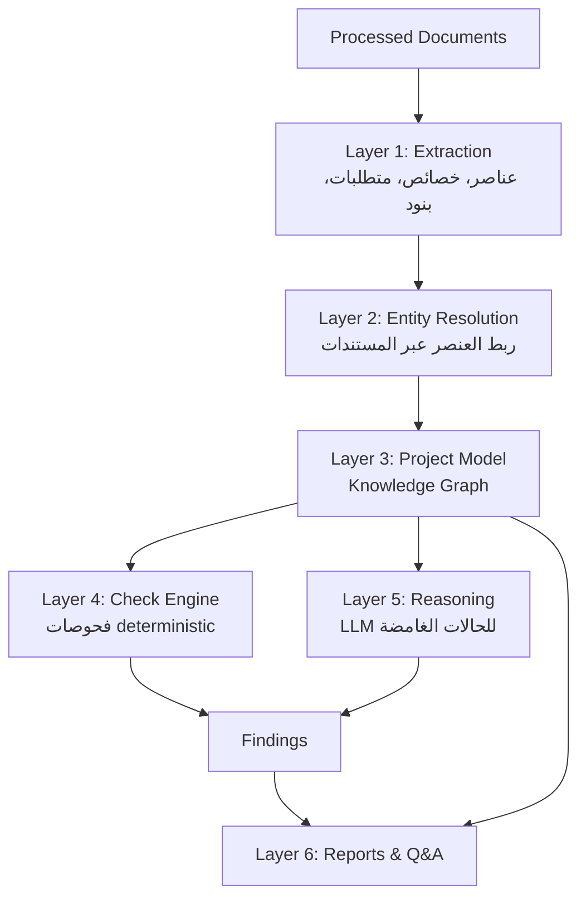
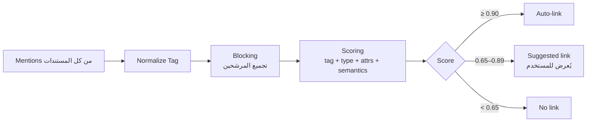
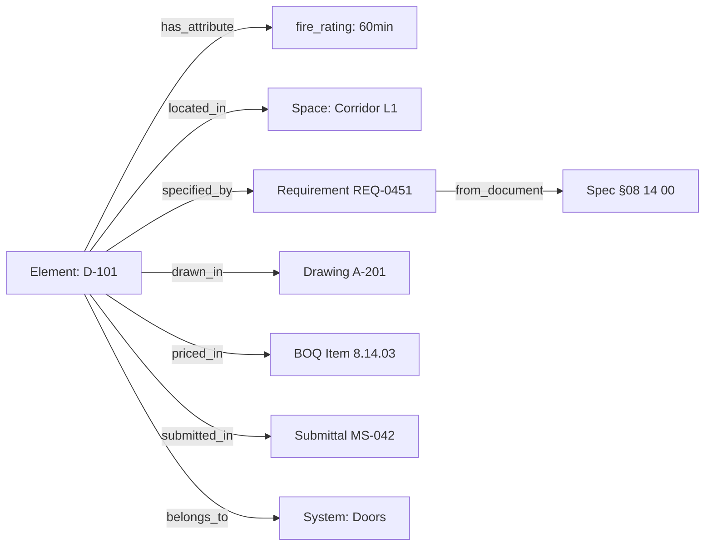
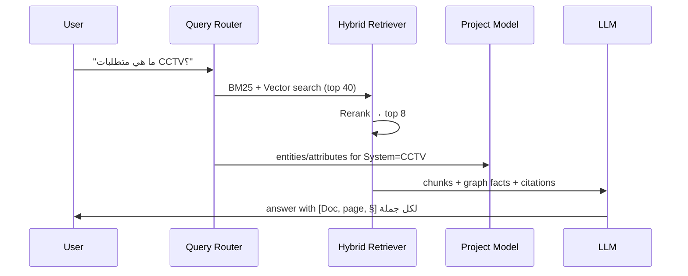

# 02 — AI Engine

| Field | Value |
|-------|-------|
| Version | 0.1 (Draft) |
| Owner | AI / ML Engineering |
| Depends on | [Document Processing](./01-DOCUMENT-PROCESSING.md) |
| Related | [Qatar Compliance Engine](./03-QATAR-COMPLIANCE-ENGINE.md) · [Test Case Library](./07-TEST-CASE-LIBRARY.md) |

> **هذا هو المنتج.** كل ما عداه واجهة أو بنية تحتية.
> مسؤولية هذه الطبقة: تحويل مستندات منفصلة إلى **نموذج مشروع واحد**، ثم فحصه واستخراج ما هو خاطئ أو ناقص أو مخالف — **مع الدليل**.

---

## 1. Architecture Layers



### التقسيم الحاكم للمسؤولية

| المهمة | المنفّذ | لماذا |
|--------|---------|-------|
| فهم نص المواصفة واستخراج المتطلب | **LLM** | لغة طبيعية معقدة ومتغيرة |
| **قراءة** رقم من سياق عربي | **Code (geometry)** | الأرقام تُستخرج معكوسة من RTL — تُقرأ بترتيب x لا نصيًا ([§10.2](./01-DOCUMENT-PROCESSING.md)) |
| مقارنة 100mm بـ 75mm | **Code** | لا يجوز أن يخطئ نموذج في مقارنة عددية |
| عدّ الأبواب | **Code (Graph query)** | الـ LLM يخطئ في العدّ بشكل منهجي |
| تحويل الوحدات | **Code** | حتمي |
| ترشيح العناصر المتشابهة للربط | **LLM + Embeddings** | تشابه دلالي |
| تأكيد الربط | **Code + عتبات + مستخدم** | قرار له تبعات |
| شرح التعارض بلغة مفهومة | **LLM** | صياغة |
| تحديد شدة التعارض | **Rules + Code** | يجب أن يكون قابلًا للتفسير والتكرار |

> **القاعدة الذهبية:** الـ LLM يقرأ ويصوغ ويرشّح. الكود يقارن ويعدّ ويقرر.
> أي قرار يظهر في تقرير رسمي يجب أن يكون **reproducible** — نفس المدخلات تعطي نفس المخرجات دائمًا.

---

## 2. Layer 1 — Extraction

استخراج كيانات منظمة من الـ blocks والـ tables القادمة من Document Processing.

### 2.1 أنواع الكيانات (Entity Taxonomy)

| Entity | التعريف | أمثلة |
|--------|---------|-------|
| `Element` | عنصر مادي في المبنى | Door D-101, Window W-12, Pump P-03 |
| `Space` | فراغ | Room 2.14, Corridor L1, Electrical Room |
| `System` | نظام | CCTV, Access Control, HVAC, Fire Alarm |
| `Material` | مادة | Insulation, Concrete C40, Gypsum Board |
| `Requirement` | متطلب مستخرج من نص | "Fire rating ≥ 60 min" |
| `CostItem` | بند في BOQ | Item 8.14.03 |
| `Submittal` | اعتماد مادة | MS-042 |
| `Query` | RFI / سؤال | RFI-118 |
| `ScopeItem` | بند نطاق عمل | "Supply and install CCTV system" |

### 2.2 استخراج المتطلبات (Requirement Extraction)

أهم عملية استخراج في النظام. تحويل نص المواصفة إلى شرط قابل للفحص آليًا:

**المدخل:**
> "All fire rated doors shall have a minimum fire resistance rating of 60 minutes and shall be fitted with self-closing devices."

**المخرَج:**

```json
[
  {
    "id": "REQ-0451",
    "applies_to": {"element_type": "door", "qualifier": "fire_rated"},
    "attribute": "fire_rating",
    "operator": ">=",
    "value": 60,
    "unit": "minutes",
    "modality": "shall",
    "source": {
      "document_id": "spec-rev-c",
      "page": 214,
      "section_path": "08 14 00 / 2.3.A",
      "raw_text": "All fire rated doors shall have a minimum fire resistance rating of 60 minutes…"
    },
    "confidence": 0.93
  },
  {
    "id": "REQ-0452",
    "applies_to": {"element_type": "door", "qualifier": "fire_rated"},
    "attribute": "self_closing_device",
    "operator": "exists",
    "value": true,
    "modality": "shall",
    "source": {"…": "…"},
    "confidence": 0.90
  }
]
```

### 2.3 Modality — قوة الإلزام

تمييز حاسم في مستندات البناء، ويحدد شدة أي مخالفة:

| Modality | العبارة | الأثر |
|----------|---------|-------|
| `shall` / `must` / `يجب` | إلزامي | مخالفته = Non-Compliance (شدة عالية) |
| `should` / `يُفضَّل` | موصى به | مخالفته = Observation (شدة منخفضة) |
| `may` / `يجوز` | اختياري | لا يُنتج مخالفة |
| `shall not` / `لا يجوز` | محظور | وجوده = مخالفة عالية |

### 2.4 مبادئ الاستخراج

- **Structured output إلزامي** — استدعاء LLM باستخدام JSON Schema (tool use)، لا parsing نصي حر.
- **Chunk-level extraction** مع تمرير `section_path` كسياق، لأن معنى البند يعتمد على قسمه.
- **No source, no requirement** — أي متطلب مستخرج بلا `source` صالح يُرفض برمجيًا قبل التخزين.
- **Idempotency** — إعادة تشغيل الاستخراج على نفس الـ chunk يجب أن تعطي نفس الـ requirement id (hash على المحتوى + الموقع).

---

## 3. Mode Detection

استنتاج وضع المراجعة من المستندات (المبدأ #3 في [README](./README.md)):

```python
def detect_modes(docs: list[ProcessedDocument]) -> list[ReviewMode]:
    types = {d.type for d in docs if d.is_current}
    modes = []

    if {"boq", "specification"} <= types and has_drawings(types):
        modes.append(ReviewMode.CONSTRUCTION)

    if "employer_requirements" in types and has_drawings(types):
        modes.append(ReviewMode.DESIGN_AND_BUILD)

    if "drawing_shop" in types and {"specification"} & types:
        modes.append(ReviewMode.SHOP_DRAWING)

    if "material_submittal" in types and "specification" in types:
        modes.append(ReviewMode.SUBMITTAL)

    return modes
```

كل mode يُفعّل مجموعة فحوصات (`check_set`) مختلفة. إذا لم يُفعَّل أي mode، تُعرض رسالة صريحة تشرح **ما هو الملف الناقص** — لا مراجعة صامتة ضعيفة.

---

## 4. Layer 2 — Entity Resolution

**القلب النابض للمنتج.** ربط `Door D-101` في Spec بنفسه في Schedule وفي Drawing وفي BOQ وفي Submittal.

### 4.1 الخوارزمية



### 4.2 Blocking — تقليل فضاء المقارنة

مقارنة كل mention بكل mention مستحيلة حسابيًا (O(n²) على عشرات الآلاف). يُستخدم blocking:

- **Block 1:** نفس الـ normalized tag (`D-101`) — يلتقط الأغلبية الساحقة.
- **Block 2:** نفس element_type + تشابه وصفي (embedding cosine ≥ 0.80).
- **Block 3:** نفس element_type + نفس الـ Space.

المقارنة تتم داخل الـ blocks فقط.

### 4.3 دالة التسجيل (Scoring)

```python
score = (
    0.45 * tag_match          # D-101 == D-101 (بعد التطبيع)
  + 0.20 * type_match         # door == door
  + 0.15 * attribute_overlap  # نفس المقاسات / نفس التصنيف
  + 0.12 * semantic_similarity# embeddings على الوصف
  + 0.08 * context_match      # نفس الـ Space أو نفس القسم
)
```

الأوزان **قابلة للمعايرة** عبر [Test Case Library](./07-TEST-CASE-LIBRARY.md)، ولا تُعدَّل يدويًا بالحدس.

### 4.4 الحالات الصعبة (ومعالجتها)

| الحالة | المعالجة |
|--------|----------|
| نفس الوسم لعنصرين مختلفين في مبنيين | تضمين `building` / `zone` في مفتاح الـ blocking |
| وسم مفقود في الـ BOQ (وصف نصي فقط) | مطابقة دلالية على الوصف + الوحدة + الكمية |
| اختلاف تسميات (`FD-07` vs `D-07 (FR)`) | جدول alias يتعلمه النظام + تأكيد المستخدم |
| بند BOQ واحد يغطي عدة عناصر | علاقة `1..n` صريحة في النموذج (`covers[]`)، لا ربط 1:1 قسري |
| عنصر في الرسمة بلا وسم أصلًا | يُسجَّل كـ `unresolved_mention` ويظهر في تقرير النواقص |

### 4.5 تعلّم من المستخدم

كل تأكيد أو رفض للربط من المستخدم يُخزَّن في `entity_link_feedback` ويُستخدم:
1. فورًا — تثبيت الربط لهذا المشروع.
2. لاحقًا — كـ alias على مستوى الـ organization.
3. دوريًا — لإعادة معايرة أوزان الـ scoring.

---

## 5. Layer 3 — Project Model

النموذج الموحد. Graph من العُقد والحواف:



### 5.1 أنواع العلاقات

`has_attribute` · `located_in` · `part_of` · `belongs_to_system` · `specified_by` · `drawn_in` · `priced_in` · `submitted_in` · `referenced_by` · `supersedes` · `covers` · `conflicts_with`

### 5.2 نموذج الخاصية (Attribute)

كل خاصية تحمل **مصدرها**، وهذا ما يجعل اكتشاف التعارض ممكنًا أصلًا:

```json
{
  "element_id": "el_d101",
  "name": "fire_rating",
  "value": 60,
  "unit": "minutes",
  "source_document_id": "spec-rev-c",
  "source_page": 214,
  "source_type": "specification",
  "confidence": 0.93
}
```

نفس الخاصية قد تأتي من **مصادر متعددة بقيم مختلفة** — هذا بالضبط تعريف التعارض:

```
fire_rating = 60  (from specification, p.214)
fire_rating = 30  (from door schedule, A-201)
                  ↓
              CONFLICT
```

### 5.3 التخزين

Postgres مع جداول علائقية (`entities`, `entity_attributes`, `entity_relations`) — وليس graph database في V1.

**السبب:** حجم الـ graph لمشروع واحد (آلاف العقد) يعمل بكفاءة تامة على Postgres مع recursive CTEs، وإضافة قاعدة بيانات ثانية تُضاعف تعقيد التشغيل بلا عائد في هذه المرحلة. يُعاد النظر في V2 مع دخول IFC Model. التفصيل في [Database Design](./05-DATABASE-DESIGN.md).

---

## 6. Layer 4 — Check Engine

المحرك الذي ينتج الـ Findings. كل فحص **deterministic وقابل للتفسير**.

### 6.1 أنواع الفحوصات

| Check Type | الوصف | مثال |
|------------|-------|------|
| `VALUE_MISMATCH` | نفس الخاصية بقيمتين مختلفتين من مصدرين | Spec 100mm vs Drawing 75mm |
| `UNIT_MISMATCH` | نفس القيمة بوحدتين متعارضتين | 100 mm vs 100 cm |
| `COUNT_MISMATCH` | عدد مختلف بين مصدرين | Schedule: 12 doors, BOQ: 10 No. |
| `MISSING_IN_BOQ` | عنصر/نظام في النطاق أو الرسومات وغير مسعّر | CCTV in scope, absent from BOQ |
| `MISSING_IN_DRAWING` | بند مسعّر أو مطلوب وغير مرسوم | BOQ item without drawing reference |
| `MISSING_ATTRIBUTE` | خاصية إلزامية غائبة | Fire door without fire rating |
| `MISSING_SUBMITTAL` | مادة تحتاج اعتمادًا ولا يوجد submittal | — |
| `REQUIREMENT_NOT_MET` | متطلب مستخرج غير محقق | Spec ≥60min، العنصر 30min |
| `ER_NOT_ADDRESSED` | بند في ER لا يقابله شيء في التصميم | — |
| `COMPLIANCE_VIOLATION` | مخالفة اشتراط قطري | [انظر وثيقة 03](./03-QATAR-COMPLIANCE-ENGINE.md) |
| `SUPERSEDED_REFERENCE` | إحالة إلى إصدار ملغى | Shop drawing يشير لـ IFC Rev A والحالي Rev C |
| `AMBIGUOUS_REQUIREMENT` | متطلب متناقض أو غير قابل للقياس | "high quality finish" |

### 6.2 مثال — VALUE_MISMATCH

```python
def check_value_mismatch(element: Element) -> list[Finding]:
    findings = []
    for attr_name, attrs in group_by_name(element.attributes):
        if len({a.si_value for a in attrs}) <= 1:
            continue                                   # لا تعارض

        # قيمة من سياق RTL لم تمر بالمسار الهندسي قد تكون معكوسة —
        # والتعارض حينها كاذب على قيمتين متطابقتين (§10.2 في وثيقة 01)
        if any(a.rtl_context and not a.geometric_read for a in attrs):
            queue_for_review(element, attr_name, reason="UNVERIFIED_RTL_NUMBER")
            continue

        # لا يُبنى finding على دليل ضعيف
        if min(a.confidence for a in attrs) < 0.70:
            queue_for_review(element, attr_name)
            continue

        findings.append(Finding(
            type="VALUE_MISMATCH",
            element_id=element.id,
            attribute=attr_name,
            severity=severity_for(attr_name, attrs),
            confidence=min(a.confidence for a in attrs),
            evidence=[to_evidence(a) for a in attrs],
        ))
    return findings
```

### 6.3 Coverage Matrix — أساس فحوصات النقص

مصفوفة تُبنى مرة وتغذّي عدة فحوصات:

| Element / System | Scope | ER | Spec | Drawing | BOQ | Submittal |
|------------------|:-----:|:--:|:----:|:-------:|:---:|:---------:|
| Fire Doors | ✔ | ✔ | ✔ | ✔ | ✔ | ✔ |
| CCTV System | ✔ | ✔ | ✔ | ✔ | ✖ | — |
| Access Control | ✔ | ✔ | ✖ | ✔ | ✔ | — |
| Insulation | — | ✔ | ✔ | ✔ | ✔ | ✖ |

كل ✖ هو **finding مرشح**. الأعمدة المطلوبة تختلف حسب الـ Mode المُفعّل.

### 6.4 Severity Model

```python
severity = base_severity[check_type] \
         × modality_factor      # shall=1.0, should=0.5
         × impact_factor        # safety=1.5, cost=1.2, aesthetic=0.7
         × scale_factor         # عدد العناصر المتأثرة
```

| Level | التعريف | مثال |
|-------|---------|------|
| **Critical** | سلامة أو مخالفة إلزامية أو أثر مالي كبير | باب حريق بلا تصنيف مقاومة |
| **High** | تعارض واضح يستوجب قرارًا قبل التنفيذ | 100mm vs 75mm |
| **Medium** | نقص أو غموض يحتاج توضيحًا | بند بلا مواصفة مرجعية |
| **Low** | ملاحظة تحسينية | تعارض في التسمية |

### 6.5 Deduplication & Grouping

نفس المشكلة قد تظهر على 40 بابًا. القاعدة:

- الـ findings المتطابقة في (النوع + الخاصية + السبب الجذري) تُجمَّع في **finding واحد** مع `affected_elements[]`.
- الشدة تتصاعد مع العدد (`scale_factor`)، لا تتكرر.
- المستخدم يرى مشكلة واحدة بـ 40 عنصرًا، لا 40 مشكلة — هذا فرق جوهري في قابلية الاستخدام.

---

## 7. Layer 5 — LLM Reasoning

يُستخدم الـ LLM **فقط** حيث لا يكفي الكود:

| الاستخدام | مثال |
|-----------|------|
| ترشيح تعارضات دلالية | "Fair-faced concrete" في المواصفة vs "Painted finish" في الرسمة |
| فهم استثناءات مكتوبة | "…except for doors in Zone C" |
| تفسير بنود متعارضة داخل نفس المستند | Section 08 يقول 60min، Section 28 يقول 90min |
| صياغة الشرح بالعربية والإنجليزية | نص الـ finding في التقرير |
| تحليل المخاطر (V3) | ما البند المرشح لـ Variation ولماذا |

### قواعد إلزامية على كل استدعاء LLM

1. **Grounding إجباري** — لا يُمرَّر إلا محتوى مسترجَع فعليًا من المستندات، ولا يُسمح بمعرفة عامة.
2. **Structured output** — JSON Schema مع tool use، ورفض المخرجات غير المطابقة.
3. **Citation إلزامي** في المخرَج — أي ادعاء بلا `source` يُسقط برمجيًا قبل العرض.
4. **"لا أعرف" مقبول ومطلوب** — النموذج مُوجَّه صراحة لإرجاع `insufficient_evidence` بدل التخمين.
5. **لا حساب** — أي رقم في المخرَج يُعاد التحقق منه مقابل الـ Project Model قبل العرض.
6. **Temperature = 0** للفحوصات؛ أعلى قليلًا للصياغة فقط.

### مثال Prompt (Conflict Explanation)

```
You are a construction document reviewer for a Qatar building project.

CONTEXT (the only facts you may use):
[SOURCE A] Specification, page 214, §08 14 00 / 2.3.A:
"All fire rated doors shall have a minimum fire resistance rating of 60 minutes."

[SOURCE B] Door Schedule, Drawing A-201, row D-101:
"D-101 | 900x2100 | FR30 | Corridor L1"

TASK:
Determine whether these two sources conflict for element D-101.

RULES:
- Use ONLY the sources above. Do not use outside knowledge.
- Every claim must cite [SOURCE A] or [SOURCE B].
- If evidence is insufficient, return is_conflict = null with a reason.
- Do not perform arithmetic; report values as written.

Return JSON matching the ConflictAssessment schema.
```

---

## 8. Layer 6 — Q&A (RAG + Graph)

### 8.1 تصنيف السؤال أولًا

```python
class QuestionType(Enum):
    COUNT        = "كم عدد Fire Doors؟"          # → Graph query
    ATTRIBUTE    = "كم سماكة العزل؟"              # → Graph query + citation
    EXISTENCE    = "هل يوجد Access Control؟"      # → Graph query
    COMPARISON   = "هل يوجد تعارض بين Spec و IFC؟" # → Findings query
    COMPLIANCE   = "هل مطابق للدفاع المدني؟"       # → Compliance findings
    OPEN         = "ما متطلبات CCTV؟"             # → RAG
    LOCATION     = "أين سماكة العزل؟"              # → RAG + citation
```

> **الأسئلة العددية لا تُمرَّر للـ LLM إطلاقًا.** تُترجم إلى استعلام على الـ Project Model، والـ LLM يصوغ الجواب حول رقم جاهز فقط.

### 8.2 مسار السؤال المفتوح (RAG)



- **Hybrid retrieval:** BM25 (يلتقط أرقام البنود والوسوم بدقة) + Vector (يلتقط المعنى) → دمج بـ Reciprocal Rank Fusion → reranking.
- **Filter بالـ metadata:** المستندات الحالية فقط (`is_current = true`) — سؤال يُجاب من رسمة ملغاة = خطأ فادح.
- **Citation إلزامي** لكل جملة في الجواب.

### 8.3 الأسئلة العربية

- كشف لغة السؤال والإجابة بنفس اللغة.
- البحث يتم بـ **اللغتين** دائمًا (المستندات مختلطة): توسيع الاستعلام بالمرادف الإنجليزي/العربي قبل الاسترجاع.
- قاموس مصطلحات ثنائي اللغة (`باب حريق` ↔ `fire door`، `عزل` ↔ `insulation`) يُبنى ويُثرى يدويًا — لا يُترك للنموذج.
- **الاستعلام يمر بنفس تطبيع المحتوى** ([Document Processing §10.1](./01-DOCUMENT-PROCESSING.md)).
  تطبيع طرف واحد فقط يجعل البحث العربي أسوأ من عدم التطبيع.
- **المطابقة على المصطلحات اللاتينية داخل نص عربي تكون ضبابية** (edit distance ≤ 2) مقابل قاموس
  المصطلحات — لأن المقاطع اللاتينية داخل فقرات RTL تتلف أثناء الاستخراج (`Access Control` →
  `Aces Control`). المطابقة الحرفية وحدها تُسقط الدليل بصمت.

---

## 9. Risk Analysis (V3)

| Risk Type | الإشارات |
|-----------|----------|
| **Variation Risk** | بند في Scope/ER وغير موجود في BOQ · تعارض Spec/Drawing غير محسوم · متطلب غامض غير قابل للقياس |
| **Claim Risk** | تعليمات متأخرة · إحالات إلى إصدارات ملغاة · RFIs مفتوحة على مسار حرج · تعارض بين ER والعقد |
| **Delay Risk** | Submittals ناقصة لعناصر طويلة التوريد · مخالفات تحتاج إعادة اعتماد من جهة رسمية |

يُقدَّم كـ **درجة احتمال + سبب + دليل**، ولا يُقدَّم كتقدير مالي في V3 — التقدير يحتاج بيانات تاريخية لا تتوفر بعد.

---

## 10. Evaluation

### 10.1 مقاييس لكل نوع فحص

| Metric | التعريف | Target V1 |
|--------|---------|-----------|
| **Precision** | من الـ findings المُصدَرة، كم صحيح | ≥ 85% |
| **Recall** | من المشاكل الحقيقية، كم اكتُشف | ≥ 70% |
| **Citation Accuracy** | نسبة الاستشهادات التي تشير للصفحة الصحيحة | ≥ 98% |
| **Link Accuracy** | دقة ربط العناصر عبر المستندات | ≥ 90% |
| **Extraction F1** | جودة استخراج المتطلبات | ≥ 0.85 |

### 10.2 Regression Gate

كل PR يمس الـ AI Engine يجب أن يمر على [Test Case Library](./07-TEST-CASE-LIBRARY.md):

```
✔ لا انخفاض في Precision يتجاوز 2%
✔ لا انخفاض في Recall يتجاوز 3%
✔ صفر انحدار على حالات Critical
✔ Citation accuracy لم تنخفض
```

### 10.3 Human-in-the-loop

كل finding يُعرض مع أزرار: **Confirm / Dismiss / Needs Info**.
هذه الإشارة هي:
1. مقياس الـ Precision الحقيقي في الإنتاج.
2. مصدر حالات اختبار جديدة (كل Dismiss = false positive يستحق حالة اختبار).
3. أساس معايرة العتبات.

---

## 11. Cost Control

معالجة مشروع 500 صفحة يجب ألا تُفلس الوحدة الاقتصادية:

| Technique | الأثر |
|-----------|-------|
| قواعد deterministic أولًا، LLM أخيرًا | تقليل الاستدعاءات جذريًا |
| Prompt caching للسياق الثابت | خفض تكلفة الاستدعاءات المتكررة |
| Batch extraction (عدة chunks/استدعاء) | تقليل overhead |
| نموذج أصغر للتصنيف، أكبر للاستنتاج | توجيه التكلفة لمكانها |
| Cache على hash المحتوى | إعادة المعالجة = صفر تكلفة للمحتوى غير المتغير |
| Vision LLM بسقف صفحات صارم | منع انفجار التكلفة على ملف رديء |

**هدف:** تكلفة معالجة ≤ 15% من سعر البيع لكل مشروع.

---

## 12. Failure & Honesty Modes

| الحالة | السلوك |
|--------|--------|
| بيانات غير كافية للفحص | `INSUFFICIENT_DATA` مع ذكر الملف الناقص — لا finding مخمَّن |
| ثقة استخراج منخفضة | Review Queue، لا تقرير |
| تعارض داخل نفس المستند | finding من نوع `INTERNAL_INCONSISTENCY` — لا محاولة ترجيح |
| العنصر موجود في مستند واحد فقط | ليس تعارضًا — يُذكر كـ `single_source` بلا شدة |
| المستخدم رفض finding مرتين لنفس السبب | خفض ترتيب النمط في هذا المشروع |

> **صمت النظام أفضل من ثقته الكاذبة.** كل مخرَج غير مؤكد يُصنَّف صراحة، ولا يُدفن في نص التقرير.
