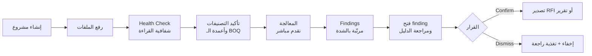

# 04 — Dashboard UX

| Field | Value |
|-------|-------|
| Version | 0.1 (Draft) |
| Owner | Product / Design / Frontend |
| Depends on | [Master PRD](./00-MASTER-PRD.md) · [AI Engine](./02-AI-ENGINE.md) |

> **مبدأ التصميم الحاكم:** المستخدم مهندس مشغول ومتشكك. لن يقرأ تقريرًا من 40 صفحة، ولن يثق بنتيجة لا يستطيع التحقق منها في ثانيتين.
> كل شاشة تجيب على سؤالين: **ما المشكلة؟** و **أين الدليل؟**

---

## 1. Information Architecture

```
Projects
 └── Project
      ├── Overview          — لوحة صحة المشروع
      ├── Documents         — المكتبة + Health Check
      ├── Findings          — التعارضات والنواقص والمخالفات  ← الشاشة الأهم
      │    └── Finding Detail — Evidence Viewer
      ├── Ask AI            — سؤال وجواب مع استشهاد
      ├── Reports           — التقارير القابلة للتصدير
      └── Settings          — الفريق، ملف المشروع، الصلاحيات
```

---

## 2. Core User Journey



**لحظة الحقيقة (Aha moment):** أول مرة يفتح المستخدم finding ويرى الصفحتين المتعارضتين جنبًا إلى جنب مع التمييز على السطر بالضبط، ويقول: "صحيح، هذا خطأ فعلي."

كل قرار تصميمي يخدم الوصول إلى هذه اللحظة **بأسرع وقت ممكن**.

---

## 3. Screen — Upload & Health Check

```
┌──────────────────────────────────────────────────────────────┐
│  New Project · Al Wakrah Office Building                      │
├──────────────────────────────────────────────────────────────┤
│                                                               │
│     ┌────────────────────────────────────────────┐            │
│     │   اسحب الملفات هنا أو اختر مجلدًا            │            │
│     │   PDF · Word · Excel                        │            │
│     └────────────────────────────────────────────┘            │
│                                                               │
│  الملفات (27)                                                 │
│  ┌───────────────────────────────────────────────────────┐    │
│  │ ✔ Specification Rev C.pdf     Specification   214 p   │    │
│  │ ✔ BOQ Final.xlsx              BOQ            1,204 r  │    │
│  │ ⏳ Architectural Drawings.pdf  IFC Drawing    ▓▓▓░ 68% │    │
│  │ ⚠ Employer Requirements.pdf   ER?  ← تأكيد النوع      │    │
│  └───────────────────────────────────────────────────────┘    │
└──────────────────────────────────────────────────────────────┘
```

### Health Check (بعد المعالجة)

```
┌──────────────────────────────────────────────────────────────┐
│  Document Health Check                                        │
├──────────────────────────────────────────────────────────────┤
│  ✔ 499 صفحة قُرئت بنجاح          ▓▓▓▓▓▓▓▓▓▓▓▓▓▓▓▓▓▓░  96%    │
│  ⚠ 18 صفحة جودة سكانر منخفضة                    [عرض]        │
│  ✖ 3 صفحات لم يمكن استخراج النص منها             [عرض]        │
│  ▦ 47 جدولًا · 4 تحتاج تأكيد أعمدة              [مراجعة]      │
│  🌐 اللغات: العربية + الإنجليزية                              │
│                                                               │
│  ⚠ ٣ صفحات لم تُقرأ — نتائج المراجعة قد لا تشملها.            │
│                                     [رفع نسخة أوضح]           │
└──────────────────────────────────────────────────────────────┘
```

**قواعد:**
- الصفحات غير المقروءة **قابلة للنقر** وتفتح على الصفحة نفسها.
- هذا التحذير يرافق المستخدم إلى التقرير النهائي — لا يُخفى بعد إغلاق الشاشة.

---

## 4. Screen — Project Overview

```
┌──────────────────────────────────────────────────────────────┐
│  Al Wakrah Office Building         Modes: Construction Review │
├──────────────────────────────────────────────────────────────┤
│                                                               │
│   Project Health          ┌────────┐                          │
│                           │   72   │  ▼ 5 منذ آخر إصدار       │
│                           └────────┘                          │
│                                                               │
│  ┌──────────┬──────────┬──────────┬──────────┬──────────┐    │
│  │ Conflicts│ Missing  │Compliance│  Risks   │  Files   │    │
│  │    23    │    14    │    9     │    6     │  27/27   │    │
│  │ 4 critical│ 3 critical│2 critical│          │  ✔ ready │    │
│  └──────────┴──────────┴──────────┴──────────┴──────────┘    │
│                                                               │
│  أهم ٥ نتائج تحتاج قرارًا                                      │
│  ⚠ CRITICAL  أبواب حريق بلا تصنيف مقاومة          3 عناصر     │
│  ⚠ CRITICAL  CCTV في النطاق وغير موجود في الـ BOQ            │
│  ⚠ HIGH      سماكة العزل 100mm ضد 75mm                       │
│  ⚠ HIGH      إحالة إلى IFC Rev A (ملغى)          7 رسومات    │
│  ⚠ HIGH      12 بابًا في الجدول مقابل 10 في الـ BOQ           │
│                                              [كل النتائج ←]   │
└──────────────────────────────────────────────────────────────┘
```

### Project Health Score

مؤشر واحد يفهمه المدير غير التقني:

```
score = 100
      − (critical × 8)
      − (high × 3)
      − (medium × 1)
      − (unreadable_pages_ratio × 20)
      − (missing_document_types × 5)
```

**قواعد العرض:**
- المؤشر مصحوب دائمًا بـ **"مما يتكون؟"** — رقم غامض بلا تفسير يُفقد الثقة.
- يُعرض اتجاه التغير عبر الزمن (بعد كل إصدار مستندات).
- **لا يُعرض كنسبة مطابقة** ولا كتقييم رسمي.

---

## 5. Screen — Findings (الشاشة الأهم)

```
┌────────────────┬─────────────────────────────────────────────┐
│  الفلاتر        │  Findings (46)              ترتيب: الشدة ▼  │
│                │                                              │
│  الشدة          │ ┌──────────────────────────────────────────┐│
│  ☑ Critical  9 │ │⚠ CRITICAL · Missing Requirement          ││
│  ☑ High     18 │ │ أبواب حريق بدون تصنيف مقاومة              ││
│  ☐ Medium   14 │ │ FD-07, FD-08, FD-11                      ││
│  ☐ Low       5 │ │ Drawings p.41 · Spec §08 14 00           ││
│                │ │ ثقة 91%          [✔ تأكيد] [✖ رفض] [↗]   ││
│  النوع          │ └──────────────────────────────────────────┘│
│  ☑ Conflict    │ ┌──────────────────────────────────────────┐│
│  ☑ Missing     │ │⚠ CRITICAL · Missing Scope                ││
│  ☑ Compliance  │ │ نظام CCTV في النطاق وغير مسعّر في الـ BOQ  ││
│  ☐ Risk        │ │ Scope p.12 · BOQ (لا يوجد)                ││
│                │ │ ثقة 88%          [✔ تأكيد] [✖ رفض] [↗]   ││
│  التخصص         │ └──────────────────────────────────────────┘│
│  ☑ Architect.  │ ┌──────────────────────────────────────────┐│
│  ☑ MEP         │ │⚠ HIGH · Value Mismatch                   ││
│  ☑ Structural  │ │ سماكة العزل: 100mm (Spec) ضد 75mm (IFC)  ││
│                │ │ Spec p.214 · Drawing A-405               ││
│  الحالة         │ │ ثقة 94%          [✔ تأكيد] [✖ رفض] [↗]   ││
│  ☑ مفتوح       │ └──────────────────────────────────────────┘│
│  ☐ مؤكد        │                                              │
│  ☐ مرفوض       │                                              │
└────────────────┴─────────────────────────────────────────────┘
```

### قواعد التصميم

| القاعدة | السبب |
|---------|-------|
| الترتيب الافتراضي: **الشدة ثم الثقة** | المستخدم يريد الأخطر أولًا |
| **العناصر المتأثرة مُجمَّعة** في finding واحد | 40 بابًا بنفس المشكلة = بطاقة واحدة لا 40 |
| **المصدر ظاهر على البطاقة** قبل الفتح | يبني الثقة فورًا |
| **الثقة معروضة صراحةً** | المستخدم يقرر كم يصدّق |
| **Confirm/Dismiss بنقرة واحدة** | التغذية الراجعة هي وقود تحسين النظام |
| **زر "تصدير كـ RFI"** | يربط المنتج بسير العمل الفعلي |

---

## 6. Screen — Finding Detail (Evidence Viewer)

**أهم شاشة في المنتج.** هنا تُكسب الثقة أو تُفقد.

```
┌──────────────────────────────────────────────────────────────┐
│  ← رجوع    ⚠ HIGH · Value Mismatch · سماكة العزل    ثقة 94%  │
├────────────────────────────┬─────────────────────────────────┤
│  المصدر أ — Specification   │  المصدر ب — IFC Drawing         │
│  Rev C · p.214 · §07 21 00 │  A-405 Rev 2 · Detail 3         │
│ ┌────────────────────────┐ │ ┌─────────────────────────────┐ │
│ │                        │ │ │                             │ │
│ │  …thermal insulation   │ │ │      ╔═══════════╗          │ │
│ │  ▓▓thickness of 100 mm▓│ │ │      ║  ▓75mm▓   ║          │ │
│ │  shall be provided…    │ │ │      ╚═══════════╝          │ │
│ │                        │ │ │                             │ │
│ └────────────────────────┘ │ └─────────────────────────────┘ │
│  [فتح الصفحة كاملة]        │  [فتح الصفحة كاملة]              │
├────────────────────────────┴─────────────────────────────────┤
│  الشرح                                                        │
│  تنص المواصفة على سماكة عزل حراري لا تقل عن 100 مم لهذا       │
│  المكوّن، بينما يُظهر التفصيل في الرسمة A-405 سماكة 75 مم.     │
│                                                               │
│  الأثر: قد يستوجب إعادة عمل أو أمر تغيير إذا نُفّذ بالسماكة    │
│  الأقل. يُنصح بحسم القيمة قبل التوريد.                        │
│                                                               │
│  العناصر المتأثرة: External Wall Type EW-02 (14 موقعًا)       │
├──────────────────────────────────────────────────────────────┤
│  [✔ تأكيد]  [✖ رفض]  [؟ يحتاج معلومات]  [↗ RFI]  [👤 إسناد] │
│                                                               │
│  💬 التعليقات (2)                                             │
│  أحمد · منذ ساعتين — "أرسلنا RFI للاستشاري"                   │
└──────────────────────────────────────────────────────────────┘
```

### متطلبات إلزامية

1. **Highlight دقيق** — التمييز على الـ bbox المستخرج بالضبط، لا على الصفحة كاملة.
2. **عرض متجاور** للمصدرين — المقارنة البصرية أسرع من أي شرح نصي.
3. **الصفحة الأصلية** لا نص مُعاد كتابته — المستخدم يريد رؤية المستند نفسه.
4. **زمن الفتح < 1.5 ثانية** — عبر تصيير مسبق (pre-render) لصفحات الأدلة.
5. **الشرح بلغة المستخدم** — عربي أو إنجليزي.

---

## 7. Screen — Ask AI

```
┌──────────────────────────────────────────────────────────────┐
│  Ask AI · Al Wakrah Office Building                           │
├──────────────────────────────────────────────────────────────┤
│  👤 كم عدد Fire Doors في المشروع؟                             │
│                                                               │
│  🤖 **24 بابًا** مصنّفة كأبواب حريق.                          │
│                                                               │
│     التوزيع:                                                  │
│     • Door Schedule (A-201): 24 بابًا                         │
│     • BOQ (البند 8.14.03): 22 بابًا  ⚠                        │
│                                                               │
│     ⚠ يوجد فرق بين الجدول والـ BOQ (بابان).                   │
│       [عرض النتيجة المرتبطة →]                                │
│                                                               │
│     المصادر: Drawings p.41 · BOQ Final.xlsx صف 812            │
│                                                               │
├──────────────────────────────────────────────────────────────┤
│  اقتراحات:                                                    │
│  [هل الـ BOQ يغطي كل عناصر المشروع؟]  [ما متطلبات CCTV؟]      │
│  [هل يوجد تعارض بين Spec و IFC؟]                              │
└──────────────────────────────────────────────────────────────┘
```

### قواعد

- **كل جملة تحمل مصدرها.** بلا مصدر = لا تُعرض.
- **الأرقام تأتي من Project Model** لا من الـ LLM ([AI Engine §8](./02-AI-ENGINE.md)).
- **الربط بالـ Findings** — إذا كان السؤال يلامس finding موجودًا، يُعرض الرابط.
- **"لا توجد معلومات كافية"** جواب مقبول ومطلوب، مع ذكر الملف الناقص.
- أسئلة مقترحة تُشتق من محتوى المشروع لا قائمة ثابتة.

---

## 8. Screen — Documents Library

```
┌──────────────────────────────────────────────────────────────┐
│  Documents (27)                    [+ رفع]  [🔍 بحث في الكل]  │
├──────────────────────────────────────────────────────────────┤
│  النوع              الملف                  إصدار  صفحات  حالة │
│  Specification      Specification Rev C     C     214    ✔    │
│  BOQ                BOQ Final.xlsx          —   1,204    ✔    │
│  IFC Drawing        Architectural Drawings  2      96    ⚠ 18 │
│  IFC Drawing        Architectural Drawings  1      94  ⊘ ملغى │
│  Shop Drawing       SD-A-018                B      12    ✔    │
├──────────────────────────────────────────────────────────────┤
│  ⊘ الإصدارات الملغاة لا تدخل في المراجعة    [عرض الملغاة]     │
└──────────────────────────────────────────────────────────────┘
```

عرض الإصدارات الملغاة صراحةً يمنع سؤالًا متكررًا: "هل راجعتم النسخة الأخيرة؟"

---

## 9. Reports Screen

```
┌──────────────────────────────────────────────────────────────┐
│  Reports                                                      │
├──────────────────────────────────────────────────────────────┤
│  📄 Executive Summary          صفحة واحدة    [PDF] [معاينة]   │
│  📄 Conflict Report            23 نتيجة      [PDF] [Excel]    │
│  📄 Missing Items Report       14 نتيجة      [PDF] [Excel]    │
│  📄 Qatar Compliance Report    9 نتائج       [PDF]            │
│  📄 Design Review Report       شامل          [PDF] [Word]     │
│  📄 Project Health Report      اتجاهات        [PDF]           │
├──────────────────────────────────────────────────────────────┤
│  خيارات التصدير                                               │
│  ☑ تضمين لقطات الأدلة   ☑ النتائج المؤكدة فقط                 │
│  ☑ التحذيرات (صفحات لم تُقرأ)   لغة: [عربي ▾]                 │
└──────────────────────────────────────────────────────────────┘
```

**قواعد التقرير:**
- Executive Summary صفحة واحدة فعلًا — لا صفحتين.
- كل بند يحمل مرجعه (ملف/صفحة/بند).
- تحذير الصفحات غير المقروءة **إلزامي وغير قابل للإخفاء**.
- إخلاء المسؤولية الاستشارية في كل تقرير مطابقة.

---

## 10. Bilingual & RTL

المنتج ثنائي اللغة بشكل أصيل، لا ترجمة لاحقة:

| المتطلب | التفصيل |
|---------|---------|
| اتجاه الواجهة | RTL كامل في الوضع العربي (تخطيط، أيقونات، تنقّل) |
| الأرقام | لاتينية دائمًا في السياق الهندسي (`100 mm` لا `١٠٠ مم`) |
| المصطلحات التقنية | تبقى بالإنجليزية داخل النص العربي (`Fire Door`, `BOQ`) — هكذا يتحدث المهندسون فعلًا |
| المستندات | تُعرض بلغتها الأصلية دائمًا — **لا تُترجم أبدًا** |
| الـ Findings | تُولَّد بالعربية والإنجليزية معًا وتُخزَّن كذلك |
| الخطوط | خط عربي واضح للأرقام والنصوص المختلطة (IBM Plex Sans Arabic أو Noto Sans Arabic) |
| التقارير | لغة قابلة للاختيار عند التصدير |

> **قاعدة حاسمة:** نص الدليل المقتبس من المستند **لا يُترجم ولا يُعاد صياغته** — يُعرض حرفيًا. الترجمة تُفقد الدليل قيمته القانونية والتقنية.

---

## 11. States

| State | التصميم |
|-------|---------|
| **Empty — لا مشاريع** | شرح من 3 خطوات + مشروع تجريبي جاهز (Demo Project) |
| **Processing** | تقدّم لكل ملف + إتاحة الأسئلة على الملفات الجاهزة + تنبيه عند الاكتمال |
| **No findings** | "لم نجد تعارضات في المستندات المرفوعة" + **ما الذي فُحص بالضبط** + ما المستندات التي قد تكشف أكثر |
| **Insufficient documents** | لا mode مُفعّل → قائمة صريحة بالملفات الناقصة ولماذا |
| **Error** | رسالة بلغة بشرية + إجراء ممكن + الاحتفاظ بما اكتمل |
| **Low confidence project** | شريط تحذير دائم أعلى الشاشة |

> حالة "لا نتائج" **يجب ألا تبدو كنجاح تام**. يجب أن تشرح نطاق الفحص بدقة، وإلا بنى المستخدم ثقة زائفة.

---

## 12. Permissions & Collaboration

| Role | الصلاحيات |
|------|-----------|
| **Owner** | كل شيء + إدارة الفريق + الحذف |
| **Editor** | رفع، مراجعة، تأكيد/رفض، تصدير |
| **Reviewer** | عرض وتعليق فقط |
| **Viewer** | عرض التقارير فقط |

- إسناد finding لعضو في الفريق + حالة (`open / in_progress / resolved`).
- تعليقات على مستوى الـ finding.
- سجل تدقيق (من أكّد ماذا ومتى) — مهم في السياق التعاقدي.

---

## 13. Non-Functional UX Requirements

| Requirement | Target |
|-------------|--------|
| First contentful paint | < 1.5s |
| فتح Finding Detail (مع الدليل) | < 1.5s |
| قائمة Findings (500 نتيجة) | virtualized، بلا تقطيع |
| عارض PDF | تحميل تدريجي، لا تحميل الملف كاملًا |
| Accessibility | تباين AA، تنقّل بلوحة المفاتيح، قارئ شاشة على النتائج |
| Mobile | قراءة فقط (تصفح النتائج والتقارير) — الرفع والمراجعة على سطح المكتب |
| Offline | لا يُدعم في V1 |

---

## 14. Design Principles

1. **Evidence first** — لا نتيجة بلا دليل مرئي قابل للفتح.
2. **Severity drives everything** — الترتيب واللون والانتباه.
3. **Group, don't flood** — مشكلة واحدة بعناصر متعددة، لا مشاكل متعددة.
4. **Show what you didn't read** — الشفافية عن حدود القراءة تسبق عرض النتائج.
5. **One-click feedback** — كل finding يحمل قرارًا بنقرة.
6. **Engineer's language** — مصطلحات المجال كما ينطقها المهندس، لا مصطلحات برمجية.
7. **Never claim certainty you don't have** — الثقة معروضة، والحدود مذكورة.
