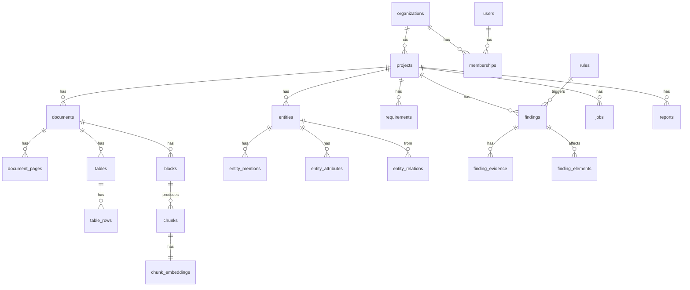

# 05 — Database Design

| Field | Value |
|-------|-------|
| Version | 0.1 (Draft) |
| Owner | Backend Engineering |
| Depends on | [Document Processing](./01-DOCUMENT-PROCESSING.md) · [AI Engine](./02-AI-ENGINE.md) |

> **قرار جوهري:** PostgreSQL واحدة (مع `pgvector`) لكل شيء — علائقي، بحث نصي، بحث دلالي، وgraph عبر recursive CTEs.
> السبب: حجم مشروع واحد (آلاف العناصر، عشرات آلاف الـ chunks) يعمل بكفاءة تامة على Postgres. إضافة graph DB أو vector DB منفصلة تُضاعف تعقيد التشغيل بلا عائد في V1، وتُعقّد وضع On-Premises بشكل خاص.

---

## 1. Storage Strategy

| Data | Store | السبب |
|------|-------|-------|
| كل البيانات المنظمة | **PostgreSQL 16+** | ACID، علاقات معقدة، RLS |
| Embeddings | **pgvector** | داخل نفس القاعدة — لا مزامنة |
| Full-text search | **Postgres FTS** (+ `pg_trgm` للعربية) | BM25-like بلا خدمة إضافية |
| الملفات الأصلية + صور الصفحات | **S3-compatible** (MinIO للـ on-prem) | رخيص، قابل للتوسع |
| الطوابير والحالة المؤقتة | **Redis** | jobs، cache، rate limits |

---

## 2. Multi-Tenancy

```
Organization  (مقاول / استشاري / مالك)
   └── Project
        ├── Documents
        ├── Entities
        └── Findings
```

**العزل عبر Row-Level Security** — `organization_id` في كل جدول رئيسي، والتطبيق يمرر `app.current_org` في كل transaction:

```sql
ALTER TABLE projects ENABLE ROW LEVEL SECURITY;

CREATE POLICY org_isolation ON projects
  USING (organization_id = current_setting('app.current_org')::uuid);
```

> **ليس اختياريًا.** بيانات مشاريع حكومية حساسة — تسرّب بين tenants حدث وجودي للشركة. RLS طبقة دفاع ثانية خلف فلترة التطبيق، لا بديلًا عنها.

---

## 3. Schema Overview



---

## 4. Core Tables

### 4.1 Tenancy & Access

```sql
CREATE TABLE organizations (
    id              uuid PRIMARY KEY DEFAULT gen_random_uuid(),
    name            text NOT NULL,
    country         text NOT NULL DEFAULT 'QA',
    data_residency  text NOT NULL DEFAULT 'qa',   -- qa | eu | on_prem
    created_at      timestamptz NOT NULL DEFAULT now()
);

CREATE TABLE users (
    id            uuid PRIMARY KEY DEFAULT gen_random_uuid(),
    email         citext UNIQUE NOT NULL,
    full_name     text,
    locale        text NOT NULL DEFAULT 'ar',      -- ar | en
    created_at    timestamptz NOT NULL DEFAULT now()
);

CREATE TYPE org_role AS ENUM ('owner','editor','reviewer','viewer');

CREATE TABLE memberships (
    organization_id uuid NOT NULL REFERENCES organizations(id) ON DELETE CASCADE,
    user_id         uuid NOT NULL REFERENCES users(id) ON DELETE CASCADE,
    role            org_role NOT NULL,
    PRIMARY KEY (organization_id, user_id)
);
```

### 4.2 Projects

```sql
CREATE TABLE projects (
    id              uuid PRIMARY KEY DEFAULT gen_random_uuid(),
    organization_id uuid NOT NULL REFERENCES organizations(id) ON DELETE CASCADE,
    name            text NOT NULL,
    client          text,
    profile         jsonb NOT NULL DEFAULT '{}',   -- ProjectProfile (وثيقة 03 §3)
    detected_modes  text[] NOT NULL DEFAULT '{}',  -- construction | design_build | ...
    health_score    numeric(5,2),
    status          text NOT NULL DEFAULT 'active',
    created_by      uuid REFERENCES users(id),
    created_at      timestamptz NOT NULL DEFAULT now(),
    updated_at      timestamptz NOT NULL DEFAULT now()
);
CREATE INDEX ON projects (organization_id, status);
```

### 4.3 Documents

```sql
CREATE TYPE document_type AS ENUM (
    'contract','employer_requirements','scope_of_work','specification','boq',
    'drawing_ifc','drawing_shop','material_submittal','rfi','mom',
    'inspection_report','schedule','correspondence','other'
);

CREATE TABLE documents (
    id                uuid PRIMARY KEY DEFAULT gen_random_uuid(),
    project_id        uuid NOT NULL REFERENCES projects(id) ON DELETE CASCADE,
    organization_id   uuid NOT NULL REFERENCES organizations(id),
    file_name         text NOT NULL,
    storage_key       text NOT NULL,               -- S3 key
    sha256            text NOT NULL,
    mime_type         text NOT NULL,
    size_bytes        bigint NOT NULL,

    doc_type          document_type,
    type_confidence   numeric(4,3),
    type_confirmed_by uuid REFERENCES users(id),

    document_number   text,                        -- من Title Block
    revision          text,
    document_family   text,                        -- يجمع الإصدارات
    is_current        boolean NOT NULL DEFAULT true,
    superseded_by     uuid REFERENCES documents(id),

    page_count        int,
    languages         text[] NOT NULL DEFAULT '{}',
    processing_status text NOT NULL DEFAULT 'pending',
    health            jsonb NOT NULL DEFAULT '{}', -- DocumentHealth (وثيقة 01 §13)
    uploaded_at       timestamptz NOT NULL DEFAULT now(),
    UNIQUE (project_id, sha256)
);
CREATE INDEX ON documents (project_id, doc_type) WHERE is_current;
```

### 4.4 Extracted Content

```sql
CREATE TABLE document_pages (
    id               uuid PRIMARY KEY DEFAULT gen_random_uuid(),
    document_id      uuid NOT NULL REFERENCES documents(id) ON DELETE CASCADE,
    page_number      int NOT NULL,
    width            numeric, height numeric,
    page_kind        text,        -- digital | scanned | hybrid
    scan_quality     numeric(4,3),
    ocr_confidence   numeric(4,3),
    image_key        text,        -- صورة الصفحة للـ Evidence Viewer
    issues           jsonb NOT NULL DEFAULT '[]',
    UNIQUE (document_id, page_number)
);

CREATE TABLE blocks (
    id                uuid PRIMARY KEY DEFAULT gen_random_uuid(),
    document_id       uuid NOT NULL REFERENCES documents(id) ON DELETE CASCADE,
    page_number       int NOT NULL,
    block_type        text NOT NULL,       -- heading | paragraph | table | title_block | ...
    bbox              numeric[4] NOT NULL,
    raw_text          text NOT NULL,
    normalized_text   text,
    section_path      text,                -- "08 14 00 / 2.3.A"
    language          text,
    confidence        numeric(4,3) NOT NULL,
    extraction_method text NOT NULL,       -- native_pdf | ocr_tesseract | vision_llm
    reading_order     int
);
CREATE INDEX ON blocks (document_id, page_number);
CREATE INDEX ON blocks USING gin (to_tsvector('simple', normalized_text));
CREATE INDEX ON blocks USING gin (normalized_text gin_trgm_ops);   -- للعربية
```

### 4.5 Tables (BOQ & Schedules)

```sql
CREATE TABLE extracted_tables (
    id                uuid PRIMARY KEY DEFAULT gen_random_uuid(),
    document_id       uuid NOT NULL REFERENCES documents(id) ON DELETE CASCADE,
    pages             int[] NOT NULL,
    table_kind        text,                -- boq | door_schedule | load_schedule | generic
    headers           text[] NOT NULL,
    canonical_mapping jsonb NOT NULL DEFAULT '{}',
    confidence        numeric(4,3) NOT NULL,
    sanity_checks     jsonb NOT NULL DEFAULT '[]',
    mapping_confirmed_by uuid REFERENCES users(id)
);

CREATE TABLE table_rows (
    id          uuid PRIMARY KEY DEFAULT gen_random_uuid(),
    table_id    uuid NOT NULL REFERENCES extracted_tables(id) ON DELETE CASCADE,
    row_index   int NOT NULL,
    page_number int NOT NULL,
    cells       jsonb NOT NULL,   -- [{raw, value, unit, bbox, confidence}]
    canonical   jsonb NOT NULL DEFAULT '{}',  -- {item_no, description, unit, quantity, rate, amount}
    parent_row_id uuid REFERENCES table_rows(id),   -- تسلسل BOQ الهرمي
    confidence  numeric(4,3) NOT NULL
);
CREATE INDEX ON table_rows (table_id, row_index);
CREATE INDEX ON table_rows USING gin (canonical jsonb_path_ops);
```

### 4.6 Chunks & Embeddings

```sql
CREATE TABLE chunks (
    id           uuid PRIMARY KEY DEFAULT gen_random_uuid(),
    document_id  uuid NOT NULL REFERENCES documents(id) ON DELETE CASCADE,
    project_id   uuid NOT NULL REFERENCES projects(id) ON DELETE CASCADE,
    content      text NOT NULL,
    page_from    int NOT NULL,
    page_to      int NOT NULL,
    section_path text,
    metadata     jsonb NOT NULL DEFAULT '{}',
    token_count  int,
    confidence   numeric(4,3) NOT NULL
);
CREATE INDEX ON chunks USING gin (to_tsvector('simple', content));

CREATE TABLE chunk_embeddings (
    chunk_id   uuid PRIMARY KEY REFERENCES chunks(id) ON DELETE CASCADE,
    project_id uuid NOT NULL,
    embedding  vector(1536) NOT NULL,
    model      text NOT NULL
);
CREATE INDEX ON chunk_embeddings
    USING hnsw (embedding vector_cosine_ops);
```

> **ملاحظة أداء:** الفلترة بـ `project_id` قبل بحث الـ vector ضرورية. مع HNSW يُستخدم partial index لكل مشروع كبير، أو فلترة ما بعد البحث مع `ef_search` أعلى.

---

## 5. Project Model Tables

### 5.1 Entities

```sql
CREATE TYPE entity_kind AS ENUM (
    'element','space','system','material','cost_item','submittal','query','scope_item'
);

CREATE TABLE entities (
    id            uuid PRIMARY KEY DEFAULT gen_random_uuid(),
    project_id    uuid NOT NULL REFERENCES projects(id) ON DELETE CASCADE,
    kind          entity_kind NOT NULL,
    element_type  text,                 -- door | window | pump | camera ...
    canonical_tag text,                 -- "D-101"
    display_name  text,
    qualifiers    text[] NOT NULL DEFAULT '{}',   -- fire_rated | external ...
    resolution_confidence numeric(4,3),
    created_at    timestamptz NOT NULL DEFAULT now()
);
CREATE INDEX ON entities (project_id, kind, element_type);
CREATE INDEX ON entities (project_id, canonical_tag);

CREATE TABLE entity_aliases (
    id          uuid PRIMARY KEY DEFAULT gen_random_uuid(),
    entity_id   uuid NOT NULL REFERENCES entities(id) ON DELETE CASCADE,
    alias       text NOT NULL,
    source      text,                    -- learned | user_confirmed
    UNIQUE (entity_id, alias)
);
```

### 5.2 Mentions — كل ظهور للعنصر في مستند

```sql
CREATE TABLE entity_mentions (
    id            uuid PRIMARY KEY DEFAULT gen_random_uuid(),
    entity_id     uuid REFERENCES entities(id) ON DELETE SET NULL,  -- NULL = unresolved
    project_id    uuid NOT NULL REFERENCES projects(id) ON DELETE CASCADE,
    document_id   uuid NOT NULL REFERENCES documents(id) ON DELETE CASCADE,
    block_id      uuid REFERENCES blocks(id) ON DELETE SET NULL,
    table_row_id  uuid REFERENCES table_rows(id) ON DELETE SET NULL,
    page_number   int NOT NULL,
    bbox          numeric[4],
    raw_tag       text,
    raw_text      text,
    link_score    numeric(4,3),
    link_status   text NOT NULL DEFAULT 'auto',  -- auto | suggested | user_confirmed | user_rejected
    confidence    numeric(4,3) NOT NULL
);
CREATE INDEX ON entity_mentions (project_id, entity_id);
CREATE INDEX ON entity_mentions (project_id) WHERE entity_id IS NULL;  -- unresolved
```

### 5.3 Attributes — مع مصدرها (أساس اكتشاف التعارض)

```sql
CREATE TABLE entity_attributes (
    id             uuid PRIMARY KEY DEFAULT gen_random_uuid(),
    entity_id      uuid NOT NULL REFERENCES entities(id) ON DELETE CASCADE,
    project_id     uuid NOT NULL,
    name           text NOT NULL,          -- fire_rating | thickness | width
    raw_value      text NOT NULL,
    value_numeric  numeric,
    value_text     text,
    unit           text,
    si_value       numeric,                -- القيمة المطبَّعة للمقارنة
    source_document_id uuid NOT NULL REFERENCES documents(id) ON DELETE CASCADE,
    source_type    document_type NOT NULL,
    source_page    int NOT NULL,
    source_block_id uuid REFERENCES blocks(id),
    bbox           numeric[4],
    confidence     numeric(4,3) NOT NULL
);
CREATE INDEX ON entity_attributes (entity_id, name);
```

> **جوهر التصميم:** نفس `(entity_id, name)` بقيم `si_value` مختلفة من `source_document_id` مختلفة = **تعارض**. الفحص استعلام SQL بسيط لا استدعاء نموذج:

```sql
SELECT entity_id, name, count(DISTINCT si_value) AS variants
FROM entity_attributes
WHERE project_id = $1 AND si_value IS NOT NULL AND confidence >= 0.70
GROUP BY entity_id, name
HAVING count(DISTINCT si_value) > 1;
```

### 5.4 Relations

```sql
CREATE TABLE entity_relations (
    id          uuid PRIMARY KEY DEFAULT gen_random_uuid(),
    project_id  uuid NOT NULL REFERENCES projects(id) ON DELETE CASCADE,
    from_entity uuid NOT NULL REFERENCES entities(id) ON DELETE CASCADE,
    to_entity   uuid NOT NULL REFERENCES entities(id) ON DELETE CASCADE,
    relation    text NOT NULL,   -- located_in | part_of | priced_in | covers ...
    confidence  numeric(4,3) NOT NULL,
    UNIQUE (from_entity, to_entity, relation)
);
CREATE INDEX ON entity_relations (project_id, relation);
```

### 5.5 Requirements

```sql
CREATE TABLE requirements (
    id               uuid PRIMARY KEY DEFAULT gen_random_uuid(),
    project_id       uuid NOT NULL REFERENCES projects(id) ON DELETE CASCADE,
    applies_to       jsonb NOT NULL,     -- {element_type, qualifier, system, space_type}
    attribute        text NOT NULL,
    operator         text NOT NULL,      -- >= | <= | = | exists | in
    value_numeric    numeric,
    value_text       text,
    unit             text,
    modality         text NOT NULL,      -- shall | should | may | shall_not
    source_document_id uuid NOT NULL REFERENCES documents(id) ON DELETE CASCADE,
    source_page      int NOT NULL,
    section_path     text,
    raw_text         text NOT NULL,
    confidence       numeric(4,3) NOT NULL,
    content_hash     text NOT NULL,
    UNIQUE (project_id, content_hash)     -- idempotency
);
```

---

## 6. Findings

```sql
CREATE TYPE finding_severity AS ENUM ('critical','high','medium','low');
CREATE TYPE finding_status   AS ENUM ('open','confirmed','dismissed','needs_info','resolved');

CREATE TABLE findings (
    id             uuid PRIMARY KEY DEFAULT gen_random_uuid(),
    project_id     uuid NOT NULL REFERENCES projects(id) ON DELETE CASCADE,
    organization_id uuid NOT NULL,
    check_type     text NOT NULL,            -- VALUE_MISMATCH | MISSING_IN_BOQ | ...
    rule_id        text,                     -- للمخالفات فقط
    rule_version   int,
    authority      text,                     -- QCDD | SSD | KAHRAMAA | QCS
    severity       finding_severity NOT NULL,
    confidence     numeric(4,3) NOT NULL,
    discipline     text,                     -- architectural | mep | structural
    title_en       text NOT NULL,
    title_ar       text NOT NULL,
    detail_en      text,
    detail_ar      text,
    remediation_en text,
    remediation_ar text,
    status         finding_status NOT NULL DEFAULT 'open',
    assigned_to    uuid REFERENCES users(id),
    dedup_key      text NOT NULL,            -- تجميع النتائج المتطابقة
    run_id         uuid NOT NULL,            -- أي جولة تحليل أنتجتها
    created_at     timestamptz NOT NULL DEFAULT now(),
    UNIQUE (project_id, run_id, dedup_key)
);
CREATE INDEX ON findings (project_id, severity, status);

CREATE TABLE finding_elements (
    finding_id uuid NOT NULL REFERENCES findings(id) ON DELETE CASCADE,
    entity_id  uuid NOT NULL REFERENCES entities(id) ON DELETE CASCADE,
    PRIMARY KEY (finding_id, entity_id)
);

CREATE TABLE finding_evidence (
    id           uuid PRIMARY KEY DEFAULT gen_random_uuid(),
    finding_id   uuid NOT NULL REFERENCES findings(id) ON DELETE CASCADE,
    role         text NOT NULL,        -- source_a | source_b | supporting
    document_id  uuid NOT NULL REFERENCES documents(id) ON DELETE CASCADE,
    page_number  int NOT NULL,
    bbox         numeric[4],
    section_path text,
    raw_text     text NOT NULL,
    extraction_method text,
    confidence   numeric(4,3) NOT NULL
);
CREATE INDEX ON finding_evidence (finding_id);
```

**قيد يُفرض على مستوى التطبيق (والاختبار):** `findings` بلا صف واحد على الأقل في `finding_evidence` **لا يُعرض ولا يُصدَّر**. المبدأ #1.

### Feedback

```sql
CREATE TABLE finding_feedback (
    id         uuid PRIMARY KEY DEFAULT gen_random_uuid(),
    finding_id uuid NOT NULL REFERENCES findings(id) ON DELETE CASCADE,
    user_id    uuid NOT NULL REFERENCES users(id),
    action     text NOT NULL,       -- confirm | dismiss | needs_info
    reason     text,
    created_at timestamptz NOT NULL DEFAULT now()
);
```

هذا الجدول هو **مصدر قياس Precision في الإنتاج** ومنجم حالات اختبار جديدة.

---

## 7. Rules Library

```sql
CREATE TABLE rules (
    id             text NOT NULL,          -- QCDD-FD-001
    version        int  NOT NULL,
    market         text NOT NULL DEFAULT 'QA',
    authority      text NOT NULL,
    title_en       text NOT NULL,
    title_ar       text NOT NULL,
    applicability  jsonb NOT NULL,
    check_spec     jsonb NOT NULL,
    severity       finding_severity NOT NULL,
    reference      jsonb NOT NULL,         -- {document, edition, clause}
    remediation_en text, remediation_ar text,
    status         text NOT NULL DEFAULT 'draft',
    reviewed_by    text,
    effective_from date,
    effective_to   date,
    created_at     timestamptz NOT NULL DEFAULT now(),
    PRIMARY KEY (id, version)
);
CREATE INDEX ON rules (market, authority) WHERE status = 'approved';
```

**لا حذف ولا تعديل في مكانه** — التعديل ينشئ `version + 1`، لأن تقارير صدرت بناءً على النسخة القديمة ويجب أن تبقى قابلة للتفسير.

---

## 8. Jobs, Runs & Audit

```sql
CREATE TABLE jobs (
    id           uuid PRIMARY KEY DEFAULT gen_random_uuid(),
    project_id   uuid REFERENCES projects(id) ON DELETE CASCADE,
    document_id  uuid REFERENCES documents(id) ON DELETE CASCADE,
    job_type     text NOT NULL,     -- extract | ocr | classify | embed | analyze
    status       text NOT NULL,     -- queued | running | succeeded | failed
    attempts     int NOT NULL DEFAULT 0,
    error        text,
    started_at   timestamptz, finished_at timestamptz
);
CREATE INDEX ON jobs (status, job_type);

CREATE TABLE analysis_runs (
    id            uuid PRIMARY KEY DEFAULT gen_random_uuid(),
    project_id    uuid NOT NULL REFERENCES projects(id) ON DELETE CASCADE,
    modes         text[] NOT NULL,
    rule_library_version text,
    engine_version text NOT NULL,
    model_versions jsonb NOT NULL DEFAULT '{}',
    findings_count int,
    started_at    timestamptz NOT NULL DEFAULT now(),
    finished_at   timestamptz
);

CREATE TABLE audit_log (
    id              bigserial PRIMARY KEY,
    organization_id uuid NOT NULL,
    user_id         uuid,
    action          text NOT NULL,      -- document.view | document.download | report.export
    resource_type   text NOT NULL,
    resource_id     uuid,
    ip              inet,
    metadata        jsonb NOT NULL DEFAULT '{}',
    created_at      timestamptz NOT NULL DEFAULT now()
);
CREATE INDEX ON audit_log (organization_id, created_at DESC);
```

> **`analysis_runs` ضروري للتفسير:** حين يسأل العميل "لماذا تغيرت النتائج؟" يجب أن نعرف أي نسخة محرك وأي نسخة مكتبة قواعد وأي إصدار مستندات أنتجت كل جولة.

---

## 9. Conversations (Ask AI)

```sql
CREATE TABLE conversations (
    id         uuid PRIMARY KEY DEFAULT gen_random_uuid(),
    project_id uuid NOT NULL REFERENCES projects(id) ON DELETE CASCADE,
    user_id    uuid NOT NULL REFERENCES users(id),
    title      text,
    created_at timestamptz NOT NULL DEFAULT now()
);

CREATE TABLE messages (
    id              uuid PRIMARY KEY DEFAULT gen_random_uuid(),
    conversation_id uuid NOT NULL REFERENCES conversations(id) ON DELETE CASCADE,
    role            text NOT NULL,          -- user | assistant
    content         text NOT NULL,
    question_type   text,                   -- COUNT | ATTRIBUTE | OPEN ...
    citations       jsonb NOT NULL DEFAULT '[]',
    retrieved_chunks uuid[],
    model           text,
    tokens_in int, tokens_out int,
    created_at      timestamptz NOT NULL DEFAULT now()
);
```

تخزين `retrieved_chunks` و `citations` يجعل كل إجابة **قابلة للتدقيق لاحقًا** — ضروري عند نزاع على معلومة.

---

## 10. Indexing Strategy

| Query Pattern | Index |
|---------------|-------|
| findings حسب المشروع والشدة | `(project_id, severity, status)` |
| العناصر حسب النوع | `(project_id, kind, element_type)` |
| كشف التعارض | `(entity_id, name)` على `entity_attributes` |
| بحث نصي عربي | `gin (normalized_text gin_trgm_ops)` |
| بحث نصي إنجليزي | `gin (to_tsvector(...))` |
| بحث دلالي | `hnsw (embedding vector_cosine_ops)` |
| Mentions غير المربوطة | partial index `WHERE entity_id IS NULL` |
| Audit | `(organization_id, created_at DESC)` |

**Partitioning (لاحقًا):** `blocks` و `chunks` و `audit_log` مرشحة للتقسيم بـ `project_id` أو بالشهر عند تجاوز عشرات الملايين من الصفوف.

---

## 11. Data Lifecycle

| Data | Retention | ملاحظة |
|------|-----------|--------|
| الملفات الأصلية | مدة الاشتراك + 90 يومًا | ثم حذف نهائي |
| المحتوى المستخرج | نفس المدة | — |
| Findings والتقارير | 7 سنوات (اختياري) | مدد التقادم التعاقدي في المشاريع |
| Audit log | 3 سنوات | متطلب أمني |
| Conversations | سنة، أو حسب سياسة العميل | — |

### الحذف

```sql
-- حذف مشروع = حذف كل ما يتبعه عبر ON DELETE CASCADE
DELETE FROM projects WHERE id = $1;
-- ثم حذف كائنات S3 عبر job منفصل مؤكَّد النتيجة
```

**حذف مؤكَّد (verified deletion):** عند إنهاء التعاقد يصدر تقرير حذف يوثق ما حُذف ومتى — مطلب متكرر من الجهات الحكومية.

---

## 12. Encryption & Security

| Layer | Approach |
|-------|----------|
| At rest | تشفير على مستوى القرص/التخزين (Postgres TDE أو تشفير الـ volume) + SSE على S3 |
| In transit | TLS 1.3 إلزامي داخليًا وخارجيًا |
| Application-level | تشفير حقول حساسة محددة (أسماء عملاء، أرقام عقود) بمفتاح لكل organization — لدعم "الحق في النسيان" التشغيلي |
| Keys | KMS / Vault، تدوير دوري، لا مفاتيح في الكود أو الـ env المشترك |
| Access | RLS + صلاحيات التطبيق + audit على كل قراءة مستند |
| Backups | مشفّرة، اختبار استرجاع دوري، نفس منطقة البيانات |

---

## 13. Migrations

- **أداة:** Alembic (Python) أو Prisma Migrate (Node) — حسب اختيار الـ stack في [System Architecture](./06-SYSTEM-ARCHITECTURE.md).
- **قواعد:**
  - كل تغيير schema في migration مُصدَّرة ومراجَعة.
  - **لا تغيير كاسر (breaking) بلا مسار توافق** — النشر متدرج، والنسخة القديمة تعمل أثناءه.
  - migrations البيانات الثقيلة تعمل كـ background jobs بدفعات، لا في نافذة النشر.
  - كل migration لها rollback مختبَر.
  - نشر مكتبة القواعد (`rules`) عبر seed مُصدَّرة، مستقل عن migrations الـ schema.
