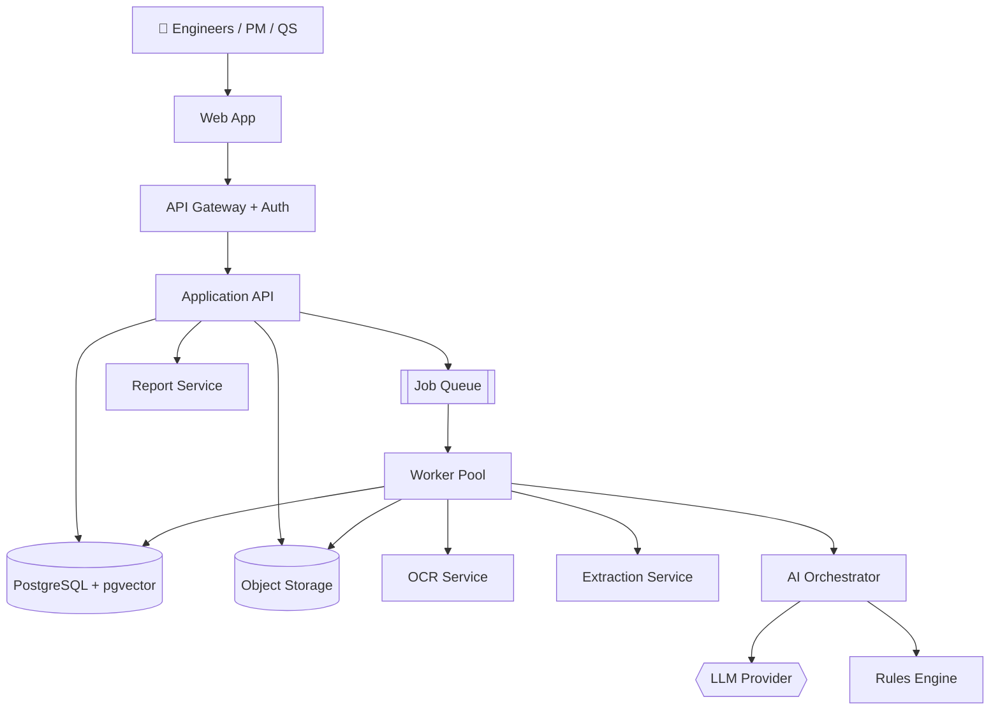
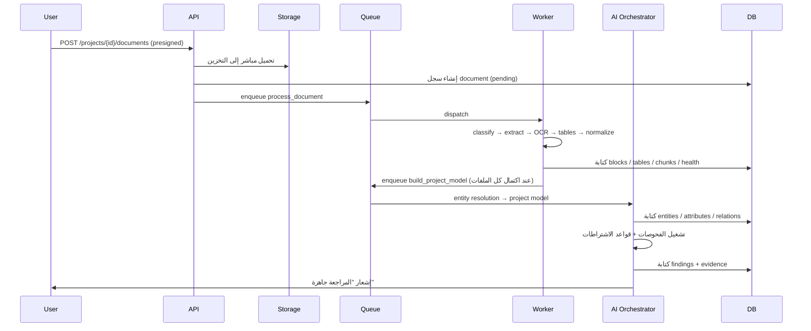
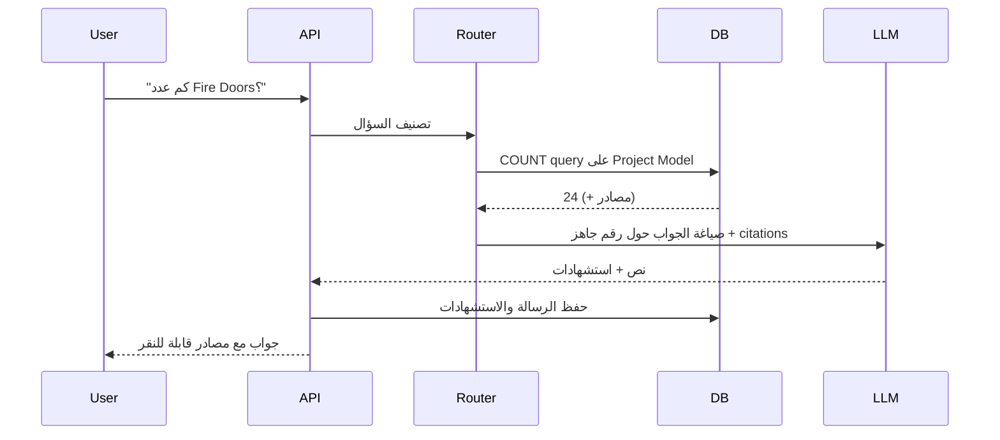

# 06 — System Architecture

| Field | Value |
|-------|-------|
| Version | 0.1 (Draft) |
| Owner | Architecture / DevOps |
| Depends on | جميع الوثائق السابقة |

> **القيد المعماري الحاكم:** المنتج سيعمل يومًا ما **داخل بيئة العميل** (مشاريع حكومية وحساسة).
> لذلك كل قرار تقني يُقاس بسؤال: **هل يمكن تشغيله بلا إنترنت وبلا خدمات سحابية خاصة؟** ما لا يمكن، يُعزل خلف واجهة قابلة للاستبدال.

---

## 1. System Context



---

## 2. Components

| Component | المسؤولية | Scaling |
|-----------|-----------|---------|
| **Web App** | الواجهة، عارض PDF، الرسوم | CDN / static |
| **API Gateway** | TLS، auth، rate limiting، routing | أفقي |
| **Application API** | CRUD، صلاحيات، استعلامات، تسليم النتائج | أفقي (stateless) |
| **Job Queue** | تنسيق المعالجة غير المتزامنة | Redis / SQS |
| **Worker Pool** | تنفيذ مراحل المعالجة | أفقي حسب طول الطابور |
| **OCR Service** | عزل OCR (CPU/GPU-bound) | مستقل — قابل للاستبدال |
| **Extraction Service** | layout، جداول، تطبيع | مستقل |
| **AI Orchestrator** | استدعاءات LLM، retrieval، caching، حدود التكلفة | مستقل |
| **Rules Engine** | تحميل وتقييم قواعد الاشتراطات | in-process |
| **Report Service** | توليد PDF/Excel/Word | مستقل (ثقيل ومتقطع) |
| **Notification** | بريد/إشعارات عند اكتمال المعالجة | خفيف |

**لماذا فصل OCR والـ Report عن الـ API:** الأول يستهلك CPU بشكل انفجاري، والثاني يستهلك ذاكرة بشكل متقطع. دمجهما مع API يجعل زمن استجابة الواجهة رهينة لعملية batch.

---

## 3. Recommended Stack

| Layer | الاختيار | السبب |
|-------|---------|-------|
| Frontend | **Next.js + TypeScript + Tailwind** | SSR، دعم RTL ناضج، سرعة تطوير |
| PDF Viewer | **PDF.js** | تحكم كامل في الـ highlighting بالإحداثيات |
| API | **FastAPI (Python)** | نفس لغة الـ ML — لا حدود ثنائية اللغة داخل خط المعالجة |
| Workers | **Celery** (أو **Temporal** للسير المعقّد) | نضج، إعادة محاولة، جدولة |
| DB | **PostgreSQL 16 + pgvector** | [Database Design](./05-DATABASE-DESIGN.md) |
| Cache/Queue | **Redis** | — |
| Storage | **S3-compatible** (MinIO للـ on-prem) | نفس الـ API في السحابة والداخل |
| OCR | **Tesseract / PaddleOCR** خلف واجهة موحدة | يعمل بلا إنترنت |
| LLM | **Claude API** (SaaS) · نموذج مفتوح مستضاف (on-prem) | خلف واجهة `LLMProvider` |
| Observability | OpenTelemetry + Prometheus + Grafana | يعمل داخليًا |

> **قرار:** Python للـ backend بالكامل في V1. تقسيم الـ backend بين Node و Python يضاعف التعقيد التشغيلي بلا مكسب، ومركز ثقل المنتج هو خط المعالجة والـ ML.

---

## 4. Key Flows

### 4.1 Upload → Findings



**Presigned upload:** الملفات تذهب من المتصفح إلى التخزين مباشرة — لا تمر عبر الـ API. يمنع اختناق الشبكة على ملفات 500MB.

### 4.2 Question → Answer



---

## 5. Deployment Topologies

ثلاثة أوضاع من **نفس قاعدة الكود** — الفرق في الـ configuration فقط:

### 5.1 SaaS Multi-Tenant (V1 — العملاء الخاصون)

```
Cloud region (قطر أو الأقرب) · RLS · مفاتيح لكل organization · LLM سحابي
```

### 5.2 Private Cloud (جهات شبه حكومية / مقاولون كبار)

```
VPC مخصص لكل عميل · قاعدة بيانات مخصصة · تخزين مخصص · LLM سحابي عبر private link
```

### 5.3 On-Premises (المشاريع الحكومية الحساسة)

```
داخل شبكة العميل · MinIO · Tesseract · LLM مستضاف محليًا · بلا إنترنت خارجي
```

| القدرة | SaaS | Private Cloud | On-Prem |
|--------|:----:|:-------------:|:-------:|
| كل الفحوصات والتقارير | ✔ | ✔ | ✔ |
| OCR | سحابي أو محلي | محلي | محلي فقط |
| LLM | Claude API | Claude API (private link) | نموذج مفتوح مستضاف |
| جودة الاستنتاج | الأعلى | الأعلى | أقل (نموذج أصغر) |
| التحديثات | تلقائية | مجدولة | إصدارات موقّعة |

> **التزام معماري:** أي feature تعتمد على خدمة سحابية خاصة لا بديل لها **تُرفض** — لأنها تُسقط وضع On-Premises، وهو شرط دخول أكبر شريحة عملاء مستهدفة.

---

## 6. Provider Abstractions

```python
class OCRProvider(Protocol):
    def recognize(self, image: bytes, langs: list[str]) -> OCRResult: ...

class LLMProvider(Protocol):
    def complete(self, messages: list[Message],
                 schema: dict | None = None,
                 temperature: float = 0.0) -> LLMResponse: ...

class EmbeddingProvider(Protocol):
    def embed(self, texts: list[str]) -> list[list[float]]: ...

class StorageProvider(Protocol):
    def put(self, key: str, data: bytes) -> None: ...
    def presigned_url(self, key: str, ttl: int) -> str: ...
```

التبديل بين المزودين = تغيير config. **هذا ليس تجريدًا مبكرًا** — بل الشرط الذي يجعل الوضعين SaaS و On-Prem نفس المنتج.

---

## 7. Security & Data Protection

### 7.1 الالتزامات

| Commitment | التنفيذ |
|------------|---------|
| **لا تدريب على بيانات العملاء** | استخدام endpoints لا تحتفظ بالبيانات + نص تعاقدي + منع أي pipeline تدريب على بيانات إنتاج |
| **عزل Tenants** | RLS + فلترة التطبيق + اختبارات عزل آلية في CI |
| **تشفير شامل** | TLS 1.3 + تشفير التخزين + تشفير حقول حساسة |
| **Audit كامل** | كل قراءة/تنزيل/تصدير مستند يُسجَّل |
| **Least privilege** | أدوار قاعدة بيانات منفصلة لكل خدمة (worker لا يقرأ جداول الفوترة) |
| **Secrets** | Vault / KMS — لا أسرار في الكود أو الصور |
| **Data residency** | اختيار المنطقة على مستوى الـ organization |
| **حذف مؤكَّد** | تقرير حذف عند إنهاء التعاقد |

### 7.2 Threat Model (الأبرز)

| Threat | Mitigation |
|--------|------------|
| تسرّب بيانات بين tenants | RLS + اختبار عزل في كل PR |
| ملف خبيث مرفوع | virus scan + معالجة في sandbox بلا صلاحيات شبكة |
| **Prompt injection من داخل مستند** | فصل صارم بين التعليمات والمحتوى؛ المحتوى المسترجَع يُعامَل كبيانات لا كتعليمات؛ لا تُمنح للنموذج أي أداة تنفيذية أثناء التحليل |
| تسريب عبر التقارير | صلاحيات على التصدير + audit + علامة مائية اختيارية |
| استخراج بيانات عبر Ask AI | كل استعلام مقيَّد بـ `project_id` على مستوى قاعدة البيانات، لا على مستوى الـ prompt |
| فقدان بيانات | نسخ احتياطية مشفّرة + اختبار استرجاع دوري |

> **Prompt injection ليس تهديدًا نظريًا هنا.** المستندات تأتي من أطراف خارجية (مقاولون، موردون)، وقد تحتوي نصًا مصمّمًا للتلاعب. القاعدة: النموذج لا يملك أدوات أثناء التحليل، ومخرجاته تُصفّى وتُطابَق مع الـ Project Model قبل العرض.

---

## 8. Scalability

| Dimension | الاستراتيجية |
|-----------|--------------|
| ملفات كبيرة | معالجة صفحة-بصفحة، بلا تحميل الملف كاملًا في الذاكرة |
| مشاريع كثيرة متزامنة | worker pool أفقي + أولوية للطوابير التفاعلية |
| Vector search | HNSW + فلترة بالمشروع + partial indexes للمشاريع الضخمة |
| قراءات ثقيلة | read replicas للتقارير والتحليلات |
| ذروة الرفع | presigned uploads + طابور مع backpressure |

**نقطة الاختناق المتوقعة الأولى:** OCR. يُعزل في pool خاص قابل للتوسع بمعزل عن باقي المعالجة، ويُقاس بـ pages/minute كمؤشر تشغيلي أساسي.

---

## 9. Reliability

| Requirement | Target |
|-------------|--------|
| Availability | 99.5% (V1) |
| Job idempotency | كل مرحلة تُعاد بأمان بلا ازدواج نتائج |
| Retry | 3 محاولات مع backoff أُسّي + dead-letter queue |
| Partial failure | فشل ملف لا يُسقط المشروع؛ النتائج تُبنى على ما نجح مع تحذير صريح |
| RPO / RTO | 1 ساعة / 4 ساعات |
| Backups | يومية + PITR، اختبار استرجاع شهري |

---

## 10. Observability

**Metrics**
`pages_processed_per_min` · `ocr_failure_rate` · `avg_extraction_confidence` · `findings_per_project` · `llm_tokens_per_project` · `llm_cost_per_project` · `job_queue_depth` · `p95_api_latency`

**Traces** — تتبّع كامل من الرفع إلى الـ finding عبر `document_id` و `run_id`.

**Logs** — منظمة (JSON)، **بلا محتوى مستندات** إطلاقًا؛ المعرفات فقط.

**Quality dashboard (داخلي)** — Precision/Recall من `finding_feedback`، توزيع الثقة، معدل الـ dismissals حسب نوع الفحص. هذه اللوحة هي بوصلة تطوير المحرك.

**Alerts** — ارتفاع فشل OCR، انخفاض متوسط الثقة، تجاوز تكلفة LLM، تعمّق الطابور، فشل عزل tenant (فوري وحرج).

---

## 11. Environments & CI/CD

```
local  →  dev  →  staging  →  production
```

**CI على كل PR:**
1. Lint + type check
2. Unit tests
3. **Tenant isolation tests** (إلزامي)
4. Integration tests (Postgres + MinIO في containers)
5. **[Test Case Library](./07-TEST-CASE-LIBRARY.md) regression gate**
6. Security scan (تبعيات + أسرار)

**النشر:** صور موقّعة، migrations قبل النشر، rolling deploy، rollback بأمر واحد.
**للـ On-Prem:** إصدارات ربع سنوية موقّعة، حزمة offline كاملة (صور + نماذج + قواعد).

---

## 12. Cost Model (تقديري)

| Component | Driver | ملاحظة |
|-----------|--------|--------|
| OCR | صفحات ممسوحة | الأثقل حسابيًا |
| LLM | استخراج + استنتاج + إجابات | الأعلى تكلفة نقدية |
| Embeddings | مرة واحدة لكل chunk | يُخزَّن ولا يُعاد |
| Storage | ملفات + صور صفحات | رخيص نسبيًا |
| Compute | workers | يتوسع مع الحمل |

**ضوابط:** سقف تكلفة LLM لكل مشروع مع تنبيه · caching على hash المحتوى · نموذج أصغر للمهام البسيطة · قواعد deterministic قبل أي استدعاء نموذج.

**هدف الوحدة الاقتصادية:** تكلفة معالجة ≤ 15% من سعر البيع لكل مشروع.

---

## 13. Build Order

| Phase | المخرَج | معيار الانتقال |
|-------|---------|----------------|
| **P0 — Foundation** | Auth، Projects، Upload، Storage، DB | رفع ملف وتخزينه بأمان |
| **P1 — Reading** | Extraction، OCR، Tables، **Health Check** | تقرير صحة صادق على مشروع حقيقي |
| **P2 — Understanding** | Entity Resolution، Project Model، Ask AI | إجابة صحيحة بمصدر على 10 أسئلة مرجعية |
| **P3 — Reviewing** | Check Engine، Findings، Evidence Viewer | **اكتشاف تعارض حقيقي في مشروع حقيقي** ← معيار النجاح الأول |
| **P4 — Compliance** | Rules Engine + مكتبة قطر (P1: 30 قاعدة) | تقرير مطابقة يعتمده مهندس |
| **P5 — Reporting** | التقارير، Dashboard، التصدير | عميل يستخدمه في اجتماع فعلي |

> **P3 هو الاختبار الوجودي للمشروع.** كل ما قبله بنية تحتية، وكل ما بعده توسّع. إن لم يكتشف النظام تعارضًا حقيقيًا لم يُكتشف يدويًا، فالمسار يُعاد النظر فيه قبل الاستثمار في P4 و P5.
